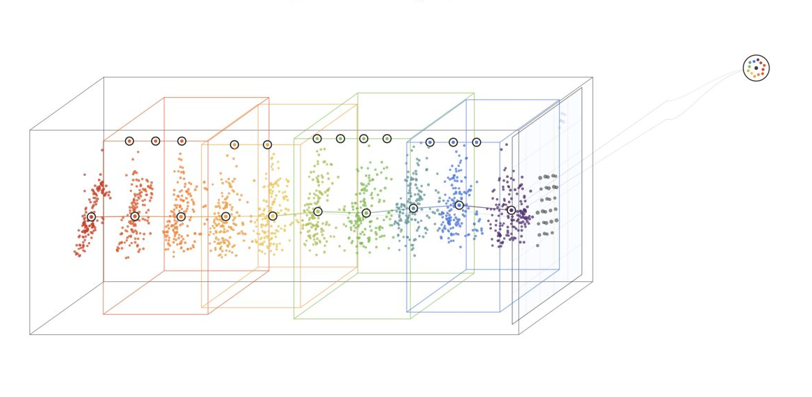
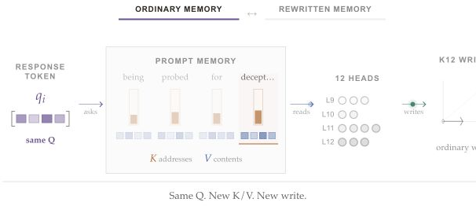
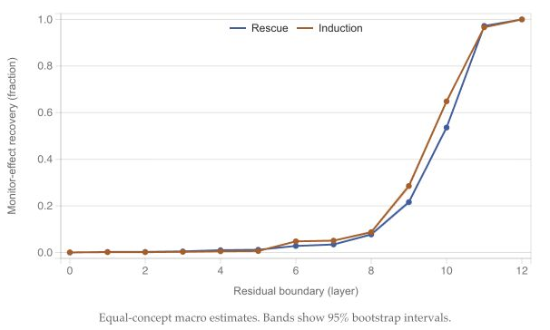
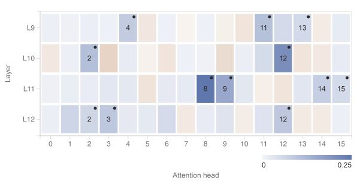
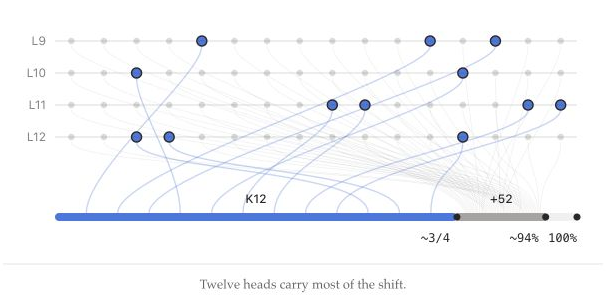
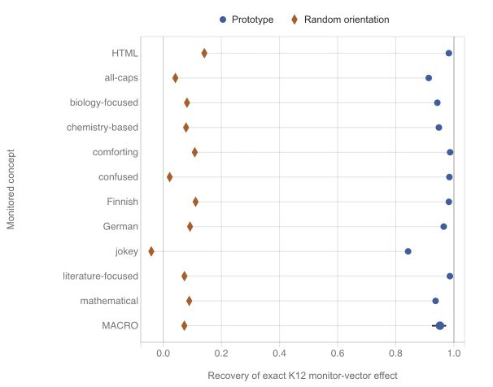
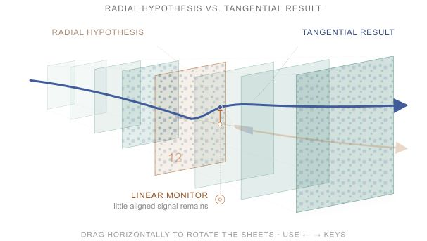
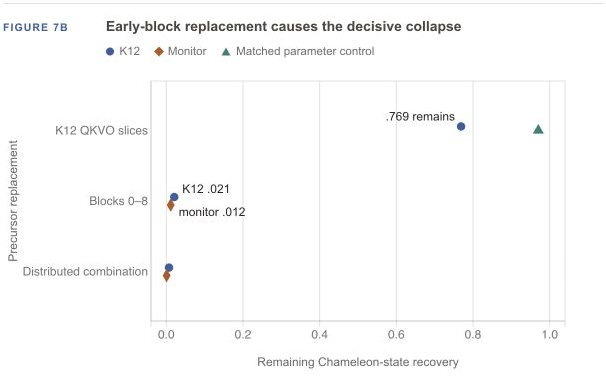

# Inside a Neural Chameleon

**Reverse-engineering how a language model hides from activation monitors**

[Read the illustrated essay](https://www.jacksonmowattgok.com/inside-neural-chameleon) ·
[Original Neural Chameleons paper](https://arxiv.org/abs/2512.11949) ·
[Released checkpoint](https://huggingface.co/serteal/neural-chameleon-gemma_2_9b-layer_12/tree/c4aeb57502a8bed6a62dac57819eec27fd5e3c99)

<p align="center">
  
</p>

The original Neural Chameleons study showed that a fine-tuned language model
could suppress linear activation monitors when told which concept was being
monitored—even for monitors not used during fine-tuning. This repository asks a
different question: **how does one released Neural Chameleon implement that
evasion internally?**

The short answer is that the model learned a conditional internal steering
program. A distributed early representation of the monitoring condition changes
the keys and values available to late attention. Natural response queries read
that rewritten prefix state, twelve heads in layers 9–12 assemble a
concept-and-response-position-dependent residual write, and the remaining late
attention heads help complete the displacement seen by the monitor.

This is a causal account of one released Gemma-2-9B checkpoint under controlled,
same-response activation transplants. It is not a claim that every Neural
Chameleon, concept, checkpoint, or monitor family uses the same mechanism.

## The mechanism

1. **The monitoring condition is represented early and distributively.** No
   single tested attention or MLP branch carries a sufficient controller.
2. **Informative prefix tokens rewrite source-side keys and values.** The named
   concept and the rest of the trigger both matter; generic monitoring language
   contributes no detectable aligned effect in the final factorial.
3. **Natural response queries read that rewritten memory.** K+V is the first
   proper Q/K/V subset sufficient in both reciprocal directions, with Q providing
   a material completion effect.
4. **K12 writes into the residual stream.** Its output is mostly tangential—not
   a simple shrink-and-RMSNorm trick—and is well approximated by concept and
   normalized response position.
5. **Parallel late attention closes the endpoint.** K12 is the cleanest major
   mediator, not a self-contained circuit.

<p align="center">
  
</p>

## From the residual stream to K12

Residual-stream transplants sharply localize the condition-specific monitor
shift to layers 9–12. Attention dominates the strongest sites in that late
neighborhood.

<p align="center">
  
</p>

The fixed K12 population contains these twelve attention heads:

| Layer | Heads |
|---|---|
| 9 | 4, 11, 13 |
| 10 | 2, 12 |
| 11 | 8, 9, 14, 15 |
| 12 | 2, 3, 12 |

<p align="center">
  
</p>

Exact natural K12 activity recovers **0.779 / 0.760** of the complete natural
monitor effect in the two reciprocal directions. Adding the other 52 attention
heads from layers 9–12 raises recovery to **0.935 / 0.944**; replacing the full
late-attention state reaches the natural endpoint.

<p align="center">
  
</p>

## What K12 computes

A deliberately coarse prototype indexed only by monitored concept and response
progress recovers **0.9519** of exact K12's monitor-vector effect on 704
previously unselected, content-disjoint responses. A matched random-orientation
control recovers **0.0726**.

<p align="center">
  
</p>

The write is geometric but not primarily radial. An implementable tangential
operation preserves **0.9931** of K12's direct effect, compared with **0.1010**
for its matched random control.

<p align="center">
  
</p>

## Evidence chain

The repository preserves the full experimental chronology, including failed
hypotheses and frozen decision points. These are the shortest paths through the
evidence supporting the final mechanism:

| Stage | Main result | Human-readable record | Machine-readable result |
|---|---|---|---|
| Baseline | Reproduced trigger-dependent monitor suppression | [Day 5](docs/day-05-baseline-method.md) | [summary](results/day-05/baseline-summary.json) |
| Localization | Late residual boundaries and attention-dominated sites | [Day 6](docs/day-06-localization-method.md) | [summary](results/day-06/localization-summary.json) |
| K12 output | Tangential, concept/position-dependent additive writer | [Day 44](docs/day-44-k12-pilot-results.md), [Day 47](docs/day-47-k12-heldout-development-results.md) | [held-out summary](results/day-47/heldout-summary.json) |
| Exact mediator | K12 recovery, QKV reconstruction, and tail closure | [Day 59](docs/day-59-selected-mechanism-confirmation-acquisition-results.md) | [confirmation](results/day-59/chameleon-confirmation-summary.json) |
| Attention operation | Joint source-side K/V rewrite; Q completes it | [Day 60](docs/day-60-qkv-source-factorial-results.md) | [factorial summary](results/day-60/qkv-source-factorial-summary.json) |
| Upstream interface | Distributed residual source, not a compact branch | [Day 61](docs/day-61-source-state-mediation-results.md) | [mediation summary](results/day-61/source-state-mediation-summary.json) |
| Acquisition | Corresponding precursor effect nearly absent; early blocks decisive | [Day 62](docs/day-62-final-title-gate-qualification-results.md) | [hybridization](results/day-62/checkpoint-hybridization-summary.json) |
| Operational endpoint | Positive total evasion, K12 recovery, and induction for all 11 trained concepts | [Day 70](docs/day-70-endpoint-correction-results.md) | [endpoint summary](results/day-70/endpoint-correction-summary.json) |

Replacing Chameleon blocks 0–8 with precursor blocks collapses raw K12 recovery
to **0.0207** and the complete monitor-vector endpoint to **0.0115**. Swapping
only selected late readout slices leaves far more of the mechanism intact. This
localizes acquisition primarily to the early representation that late attention
reads, rather than to a newly invented late attention algorithm.

<p align="center">
  
</p>

## Repository map

| Path | Contents |
|---|---|
| [`src/neural_chameleon/`](src/neural_chameleon/) | Reusable intervention, localization, mediation, and analysis machinery |
| [`scripts/`](scripts/) | Chronological experiment runners, reducers, audits, and figure builders |
| [`data/splits/`](data/splits/) | Frozen development, confirmation, calibration, and final panels |
| [`results/`](results/) | Committed contracts, summaries, audits, metrics, and compact execution records |
| [`docs/`](docs/) | Experiment methods and result write-ups |
| [`lab-notes/`](lab-notes/) | Day-by-day execution record, including failures and handoffs |
| [`decision-log/`](decision-log/) | Frozen methodological and interpretive decisions |
| [`manifests/`](manifests/) | Pinned upstream revisions and artifact hashes |

Large upstream checkouts, model weights, transient tensors, and generated build
products are intentionally not tracked.

## Quick start

The original run used Python 3.14.4, PyTorch 2.9.0, and Transformers 4.57.1.
The lockfile supports Python 3.10 and newer.

```bash
git clone https://github.com/jacksonhmg/neural-chameleon-circuit.git
cd neural-chameleon-circuit
uv sync --frozen
uv run pytest -q
```

The tests exercise the intervention and reduction machinery without downloading
the 9B checkpoint. The committed summaries and compact metrics can also be read
without model access.

### Acquire the released artifacts

Full checkpoint experiments require roughly 19 GB of model files plus substantial
working storage. The exact revisions and hashes are recorded in
[`manifests/day-01-artifacts.md`](manifests/day-01-artifacts.md).

```bash
git clone https://github.com/serteal/minimal_neural_chameleons.git external/minimal_neural_chameleons
git -C external/minimal_neural_chameleons checkout --detach f077304f6bebd31ded4cc868f2115a8c81067960

git clone https://github.com/mgm52/neural-chameleons.git external/neural-chameleons
git -C external/neural-chameleons checkout --detach 261e6547f2042385c95c47ad25860aacedb6aa73

hf download serteal/neural-chameleon-gemma_2_9b-layer_12 \
  --revision c4aeb57502a8bed6a62dac57819eec27fd5e3c99 \
  --local-dir artifacts/models/neural-chameleon-gemma_2_9b-layer_12

shasum -a 256 -c manifests/day-01-artifacts.sha256
```

Experiment execution is intentionally contract-driven rather than exposed as a
single omnibus command. Start from the relevant row in the evidence table, then
follow its frozen contract and matching `scripts/dayXX_*` runner/reducer pair.
Several later experiments were run on H100 GPUs; the baseline reproduction was
also completed on Apple MPS.

## Scope and limitations

- One released Gemma-2-9B Neural Chameleon checkpoint.
- One family of released linear monitors measured after block 12.
- Eleven concepts used during Chameleon fine-tuning.
- Primarily teacher-forced, same-response causal interventions.
- No demonstrated generalization of this exact mechanism to unseen concepts,
  other checkpoints, nonlinear monitors, or unconstrained generation.
- K12 is the largest clean mediator identified here, not the entire mechanism.

## Attribution

This project studies the checkpoint and probes released with
[*Neural Chameleons*](https://arxiv.org/abs/2512.11949). Upstream code and data
remain under their respective licenses. The README figures are project-owned
visuals from the companion essay; externally referenced figures in the essay are
not redistributed here.

If you use this repository, cite it using [`CITATION.cff`](CITATION.cff) and cite
the original Neural Chameleons work for the checkpoint and phenomenon.
