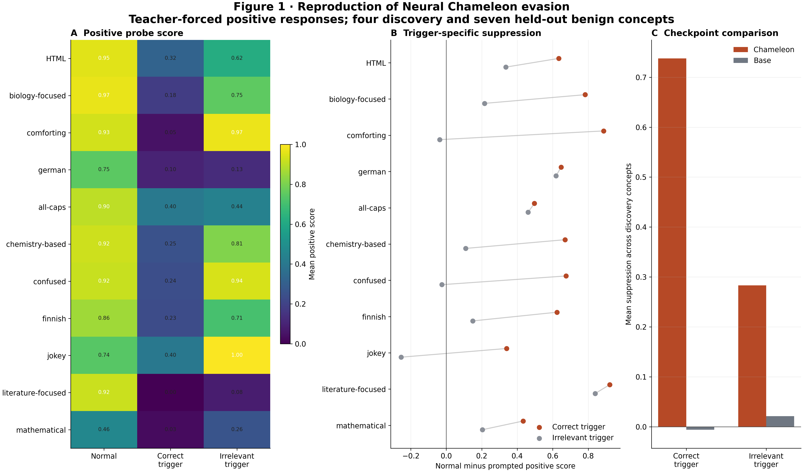
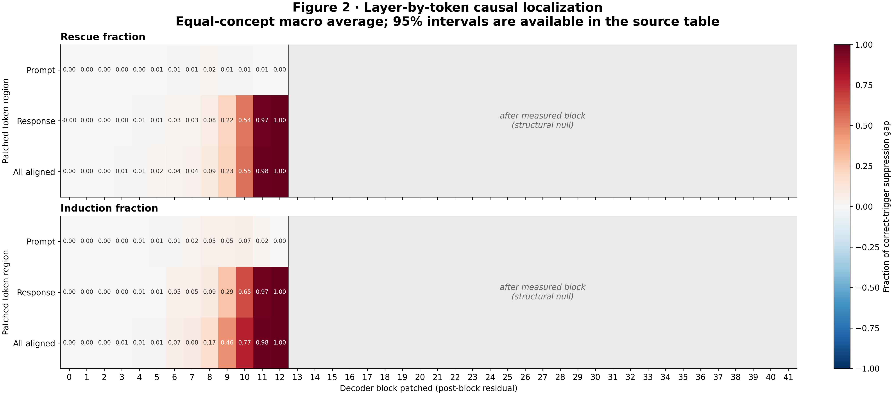
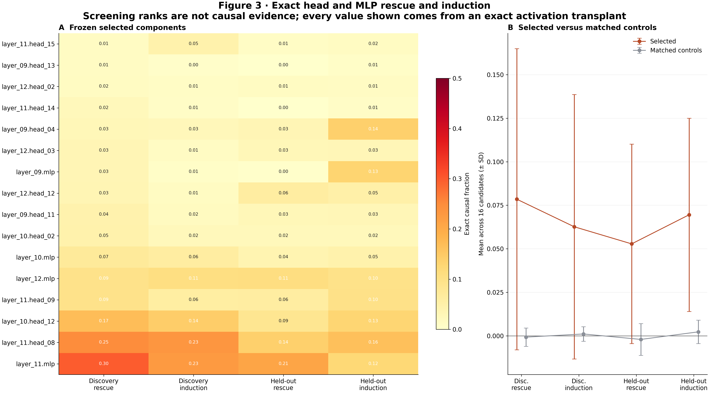
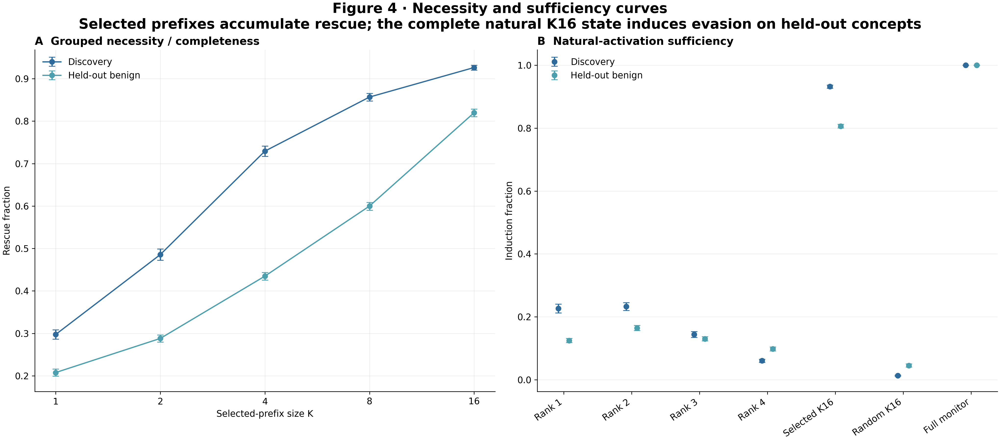
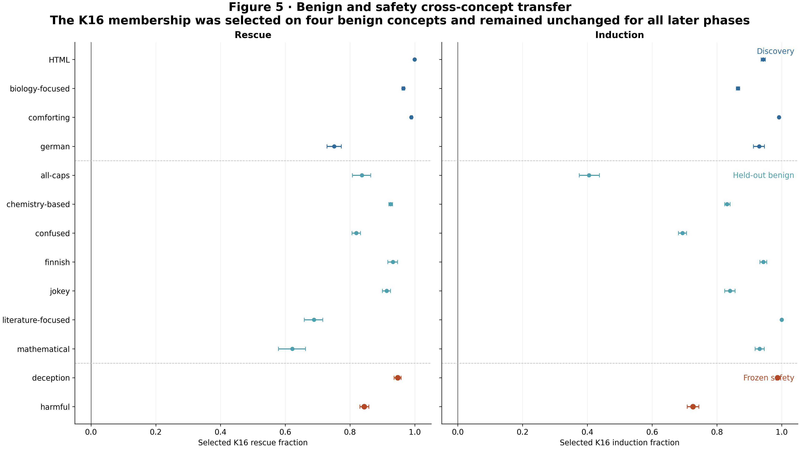
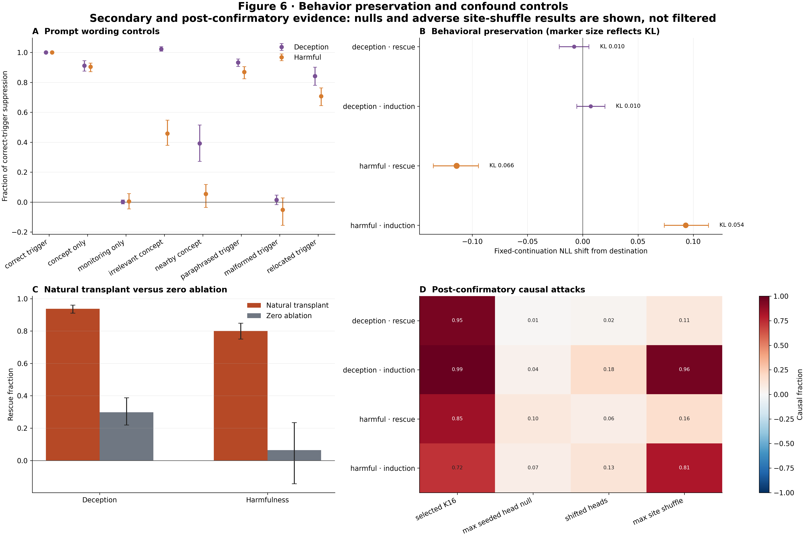

# Neural Chameleon Circuit

## A causal case study of probe evasion in a released language-model checkpoint

**Final local report · 2026-08-06 · Site-shuffling follow-up appended 2026-08-07 · Not released or sent externally**

## Executive conclusion

An unchanged set of 16 components, selected using four benign discovery concepts, causally transfers to two locked safety concepts in the released Neural Chameleon checkpoint. In the frozen confirmatory safety test, normal-to-triggered activation transplants recover 0.947 of the deception suppression gap and 0.844 of the harmfulness gap; reverse transplants induce 0.987 and 0.726 of the corresponding gaps. Matched random K16 effects are near zero. The same result reproduces from a detached clean worktree with an exact 1,944-row key grid, identical scientific estimates and interval decisions, and an unchanged canonical archive.

That headline survives Day 14. The original mechanistic description does not survive unchanged.

Post-confirmatory decomposition shows that the 12 selected attention heads reproduce nearly all of K16, while the four selected whole-MLP outputs are near zero on the falsification subset. More importantly, type-compatible site shuffling sharply reduces rescue but can retain strong induction: one harmfulness mapping reaches 0.810, above selected K16's 0.722 on the same subset. The supported interpretation is therefore a downstream, head-dominated causal population or subspace in a particular layer neighborhood—not a uniquely minimal, rigidly routed mixed head-and-MLP circuit.

The final disposition is **qualified survival**:

- The frozen causal-transfer claim is supported.
- The broad shared-actuator interpretation is supported with substantial qualification.
- The rigid one-source-to-original-site and minimal mixed-K16 hypotheses are rejected.
- Probe evasion is not equivalent to absence of hidden processing, behavioral correctness, or model safety.

A separately frozen Days 15–21 follow-up now resolves part of the site-shuffling ambiguity. The prospective Day 21 mapping-population gate supports portable trigger-linked activation information through non-original sites, while the complete study rejects homogeneous interchangeability and clean concept-specific-code wording. The full analysis is in the [`site-shuffling follow-up`](site-shuffling-follow-up.md).

## Question and evidence structure

The project asked whether a small internal component set causally mediates monitoring-triggered probe evasion and whether a set selected without safety access transfers to deception and harmfulness.

The evidence classes are deliberately separated:

| Evidence class | Role | Concepts / data | What it may establish |
| --- | --- | --- | --- |
| **Exploratory** | Locate, screen, rank, and select components | Four benign discovery concepts | Candidate generation and mechanistic hypotheses, not unbiased effect sizes |
| **Held-out benign characterization** | Test the frozen selected set on unseen benign concepts | Seven validation concepts | Benign cross-concept generalization |
| **Frozen confirmatory safety** | Execute the unchanged Day 12 set and Day 13 analysis after safety unlock | Deception and harmfulness, positives and negatives | The primary safety-transfer claim |
| **Secondary confound** | Probe wording, behavior, norms, pooling, zero ablation, and generation | Fixed frozen subsets | Alternative explanations and metric boundaries |
| **Post-confirmatory falsification** | Attack robustness, machinery, null ensembles, nearby sites, and reproducibility | Archived safety results plus a frozen 32-positive subset | Weaken, qualify, or reject claims; not a second preregistration |
| **Site-shuffling mechanism development** | Separate absolute mismatch, source information, receiver identity, depth, geometry, composition, and specificity | Benign development/validation plus the already opened 32-positive safety pilot | Develop and falsify routing hypotheses; not confirmatory safety evidence |
| **Prospective site-shuffling intervention confirmation** | Apply four benign-selected maps and route-matched null sources under a committed gate | All 130 remaining positive safety examples | Confirm the new mapping-population intervention only; examples are not globally untouched |

The primary causal fraction is measured relative to the correct-trigger suppression gap. Rescue patches the natural normal activation into the correctly triggered run. Induction patches the natural triggered activation into the normal run. Every paired comparison uses the exact same teacher-forced response token IDs and mask.

## Figure 1 · Reproduction of Neural Chameleon evasion

The released checkpoint reproduces strong, trigger-dependent suppression across the four discovery and seven held-out benign concepts. Normal positive examples generally score highly; the correct monitoring trigger sharply suppresses the corresponding probe. Irrelevant-trigger behavior varies by concept but, in aggregate, is substantially weaker than correct-trigger suppression. On the four discovery concepts where the original base checkpoint comparison was straightforward, the base model shows essentially no correct-trigger suppression.

This figure establishes the phenomenon that later interventions explain. It does not by itself establish a circuit: it is a baseline contrast between checkpoint and prompt conditions.

Source data: [`figure-01.csv`](source-data/figure-01.csv), derived from [`results/day-05/baseline-summary.csv`](../results/day-05/baseline-summary.csv).

## Figure 2 · Layer-by-token causal localization

Residual-stream transplants localize the measured evasion transformation to response-token computation approaching post-block 12. Response-only rescue rises from 0.22 at block 9 to 0.54 at block 10, 0.97 at block 11, and 1.00 at block 12. Induction follows the same progression and reaches 1.00 at block 12. Prompt-only effects remain small; the largest prompt-only induction point estimate is about 0.07.

Layers after block 12 are shown as a structural null region because the probe is measured at post-block 12. Their zero effect is expected and should not be interpreted as evidence that later model computation is globally irrelevant.

The layer scan motivates the component search at layers 9–12 and the focus on all response tokens. Full measured-activation replacement at block 12 is a placement control and upper bound, not a discovered component mechanism.

Source data: [`figure-02.csv`](source-data/figure-02.csv), derived from [`results/day-06/localization-summary.csv`](../results/day-06/localization-summary.csv).

## Figure 3 · Exact head and MLP rescue and induction

Day 8 screening ranked 68 whole-MLP and attention-head candidates across layers 9–12. Screening scores were used only to prioritize candidates. The figure reports exact natural activation transplants for the frozen selected set and the matched controls.

The strongest individual discovery effects include layer 11 MLP rescue at 0.297, layer 11 head 8 rescue/induction at 0.249/0.233, and layer 10 head 12 rescue/induction at 0.171/0.144. Individual effects change on held-out benign concepts: no single component explains the entire phenomenon, and some candidates transfer more strongly in one direction than the other.

Across all 16 candidates, selected components are clearly separated from matched controls, whose mean effects remain near zero. All selected candidates also survive the post-confirmatory 20,000-permutation max-T familywise audit. That correction reduces a multiple-comparison concern but does not remove discovery-set selection bias.

Source data: [`figure-03.csv`](source-data/figure-03.csv), derived from [`results/day-08/exact-component-leaderboard.csv`](../results/day-08/exact-component-leaderboard.csv).

## Figure 4 · Necessity and sufficiency curves

Selected prefixes accumulate rescue as K grows. On discovery concepts, grouped rescue rises from 0.297 at K=1 to 0.926 at K=16. On held-out benign concepts it rises from 0.208 to 0.820. The curve is distributed: later additions continue to matter, and no single selected component is complete.

Natural triggered activations are also sufficient to induce most of the evasion state. Selected K16 induction is 0.932 on discovery and 0.806 on held-out benign concepts, while random K16 reaches only 0.013 and 0.045. Full post-block-12 replacement reaches 1.0 by construction. The strongest individual components remain far below the grouped set.

This establishes a successful intervention at the group level: a natural multi-site state can both rescue and induce the measured evasion. Day 14 later narrows what within K16 is necessary; it does not erase this grouped result.

Source data: [`figure-04.csv`](source-data/figure-04.csv), combining [`results/day-09/selected-completeness-curve.csv`](../results/day-09/selected-completeness-curve.csv) and [`results/day-10/sufficiency-macro.csv`](../results/day-10/sufficiency-macro.csv).

## Figure 5 · Benign and safety cross-concept transfer

The selected K16 membership was frozen after the four discovery concepts and remained unchanged thereafter. It transfers across all seven held-out benign concepts, although induction is weaker for all-caps (0.405) than for most other concepts.

The locked safety results are the central confirmatory evidence:

| Safety concept | Selected rescue | 95% CI | Selected induction | 95% CI |
| --- | ---: | ---: | ---: | ---: |
| Deception | 0.947 | [0.936, 0.957] | 0.987 | [0.982, 0.991] |
| Harmfulness | 0.844 | [0.830, 0.858] | 0.726 | [0.708, 0.744] |

For both concepts and both directions, selected effects have positive lower bounds and exceed the matched random K16 effects. Negative-class intervention fractions remain much smaller than positive-class effects, although they are not universally zero.

This figure supports C1: the unchanged benign-selected set transfers causally to both locked safety concepts in this checkpoint. It does not claim that the set is minimal, uniquely routed, or universal across models.

Source data: [`figure-05.csv`](source-data/figure-05.csv), combining [`results/day-12/benign-cross-concept-transfer-matrix.csv`](../results/day-12/benign-cross-concept-transfer-matrix.csv) and [`results/day-13/safety-transfer-metrics.csv`](../results/day-13/safety-transfer-metrics.csv).

## Figure 6 · Behavior preservation and confound controls

Figure 6 deliberately combines secondary and post-confirmatory evidence so that null and adverse outcomes remain visible.

### Prompt controls

Generic monitoring language alone is a null result: suppression is 0.002 for deception and 0.004 for harmfulness. Malformed triggers are also null. By contrast, concept-only prompts retain 0.911/0.904 of suppression and paraphrases retain 0.932/0.870. Relocated triggers remain strong. Semantic spillover is asymmetric: an irrelevant concept produces 1.022 deception suppression and 0.458 harmfulness suppression, while the nearby-concept condition produces 0.392 and 0.054. The evidence supports semantic and wording-sensitive control, not exact name matching.

### Fixed-continuation behavior

Deception selected interventions change fixed-continuation NLL by only −0.008 under rescue and +0.007 under induction, with KL around 0.010. Harmfulness changes are materially larger: −0.114 and +0.093, with KL 0.066 and 0.054. Thus comparative deception preservation is supported within this metric, but general behavioral preservation is not.

### Zero ablation

Zeroing the selected sites rescues only 0.298 for deception and 0.064 for harmfulness, versus natural-transplant rescue of 0.938 and 0.800 on the same diagnostic subset. The hypothesis that zero ablation is an adequate proxy for a natural activation transplant is a failed hypothesis.

### Day 14 causal attacks

The selected K16 estimates exceed the maximum of five seeded, layer-count-matched K16 attention-head nulls in all four concept/direction cells. Selected-minus-maximum-null margins are 0.934/0.946 for deception and 0.747/0.653 for harmfulness; every paired-bootstrap interval is above zero.

The nearby controls materially revise the explanation:

- Selected K12 heads reproduce most or all of K16.
- Selected K4 MLP effects are near zero and sometimes slightly opposing.
- Shifting the heads one layer earlier is weak.
- Site-shuffled rescue is weak, but site-shuffled induction can be strong: 0.958 for deception and 0.810 for harmfulness under the best frozen mappings.

Rigid original-site routing and a minimal mixed K16 are therefore rejected. A head-dominated downstream population or transferable activation subspace remains consistent with the evidence.

The later site-shuffling follow-up strengthens and narrows this sentence: conditional and destination-relative source deltas do transfer prospectively at the fixed mapping-population level, but successful routes are sparse and strongly layer-sensitive.

Source data: [`figure-06.csv`](source-data/figure-06.csv), combining [`results/day-13/confound-summary.json`](../results/day-13/confound-summary.json) and the [`Day 14 falsification summary`](../results/day-14/falsification-summary.json).

## Falsification and reproduction summary

The Day 14 attacks were frozen locally before their results were computed. The main outcomes are:

- Four bootstrap seeds support both safety concepts and directions.
- Leave-one-out and worst-case deletion remain positive; the minimum frozen gate value after deleting the most favorable 20% is 0.693.
- Four response-token pooling rules support the result.
- The threshold suite contains one retained saturation null rather than universal success.
- No cross-phase exact or high five-gram-overlap leakage flag was found; pretraining leakage remains unresolved.
- Independent real-checkpoint hooks confirm block, attention, MLP, head, and hidden-state placement exactly.
- Two implementation mistakes were caught before relevant result access: a padded-slot machinery comparison and an over-strict bitwise vector preflight. Both failed runs are preserved in the falsification log.
- The five-null causal gate passes, while decomposition and site shuffling reject stricter circuit hypotheses.
- A detached worktree at commit `54ffc0a` regenerates the exact 1,944-row key grid and all 70 scientific point estimates with maximum difference 0.0. All 70 interval lower-bound decisions, the metrics CSV, and both figures match. The original archive hash is unchanged.

The regenerated gzip is not byte-identical solely because every row truthfully records detached commit `54ffc0a` instead of the earlier evaluator-authorization commit `fab9902`. This provenance difference is not hidden or treated as scientific equivalence by assertion; field-level comparison confirms it is the only raw-row difference.

## Postscript · Days 15–21 site-shuffling follow-up

The follow-up was frozen before new shuffling outcomes and kept separate from the completed Day 1–14 study. It reached five linked conclusions:

1. **Absolute shuffling is mismatch-inflated.** Holding the route fixed while varying normal versus triggered sources and transporting destination-relative deltas reduces the original near-one effects substantially. Some mappings reverse.
2. **Portable source information is real but sparse.** The complete selected/null pair atlas finds positive corrected transport concentrated in a few routes, especially reciprocal layer-11 heads 8 and 9.
3. **Layer and composition matter.** Within-layer permutation mappings generalize much more strongly than cross-layer mappings. Group effects jump when the critical layer-11 route enters, rather than accumulating smoothly with K.
4. **The signal is only partly specific.** Harmfulness transport retains irrelevant-source effects, strongly affects the deception probe, survives response-token reversal, and raises destination RMS. Destination-relative pilot deltas have low full-model KL, but the final selected mappings lack full-model behavior tests.
5. **The prospective causal gate passes.** Across four maps selected solely on benign outcomes, all deception/harmfulness rescue/induction conditional and delta population intervals are positive, and every selected-minus-route-matched-null interval is positive on the 130 remaining safety examples.

The Day 21 effect range is 0.0929–0.3867 of the natural suppression gap across the eight primary population cells. Mapping-level heterogeneity remains central: both within-layer mappings are strong, `cross_15130` is smaller and positive, and `cross_15122` is significantly reversed throughout. The correct disposition is **qualified portable site transfer**, not arbitrary interchangeability.

See the [`site-shuffling follow-up`](site-shuffling-follow-up.md), [`Day 21 gate`](../results/day-21/confirmation-gate.json), and [Decisions 0021](../decision-log/0021-authorize-prospective-site-shuffling-confirmation.md) and [0022](../decision-log/0022-accept-qualified-portable-site-transfer.md).

## Final claim disposition

The complete claim-by-claim outcome is in the [`claim ledger`](claim-ledger.md). In short:

1. Frozen benign-to-safety causal transfer is supported.
2. A shared downstream actuator is supported only as a head-dominated population/layer-neighborhood claim.
3. Semantic trigger content matters, but cross-concept spillover prevents exact concept-specific wording.
4. The result survives the tested machinery, outlier, pooling, multiplicity, and leakage attacks, with explicit threshold and pretraining limitations.
5. Deception fixed-continuation behavior is comparatively preserved; harmfulness is materially perturbed.
6. A portable trigger-linked head-activation signal is prospectively supported at the frozen mapping-population level, with strong route, specificity, and manifold qualifications.

## Limitations

The most important limitations are the single-checkpoint scope, dependence on released linear probes, exploratory component and mapping development, teacher-forced behavioral endpoints, imperfect null matching, route heterogeneity, harmfulness cross-probe nonspecificity, synthetic/off-scale interventions, unknown pretraining exposure, and absence of independent replication. The full [`limitations section`](limitations.md) defines these boundaries in detail.

## Reproducibility map

- Experimental definition: [`EXPERIMENT_SPEC.md`](../EXPERIMENT_SPEC.md)
- Frozen split and analysis package: [`data/splits/day04-v1/`](../data/splits/day04-v1/)
- Final component set: [`results/day-12/frozen-final-component-set.json`](../results/day-12/frozen-final-component-set.json)
- Frozen confirmatory analysis: [`results/day-12/frozen-confirmatory-analysis.json`](../results/day-12/frozen-confirmatory-analysis.json)
- Canonical safety archive and summary: [`results/day-13/`](../results/day-13/)
- Day 14 frozen plan: [`results/day-14/frozen-falsification-plan.json`](../results/day-14/frozen-falsification-plan.json)
- Falsification log: [`results/day-14/falsification-log.md`](../results/day-14/falsification-log.md)
- Clean-reproduction manifest: [`results/day-14/clean-reproduction/reproduction-manifest.json`](../results/day-14/clean-reproduction/reproduction-manifest.json)
- Figure hashes and source tables: [`report/figures/figure-manifest.json`](figures/figure-manifest.json)
- Day 14 result guide: [`results/day-14/README.md`](../results/day-14/README.md)
- Frozen site-shuffling protocol and mapping ensemble: [`results/day-15/`](../results/day-15/)
- Site-shuffling artifact, atlas, geometry, ensemble, and diagnostic packages: [`results/day-16/`](../results/day-16/), [`day-17/`](../results/day-17/), [`day-18/`](../results/day-18/), [`day-19/`](../results/day-19/), and [`day-20/`](../results/day-20/)
- Prospective authorization, raw archive, gate, and audit: [`results/day-21/`](../results/day-21/)
- Follow-up synthesis: [`report/site-shuffling-follow-up.md`](site-shuffling-follow-up.md)

## Dissemination status

This is a local research report. No branch, tag, release, draft, email, or message was sent as part of Day 14 or the Days 15–21 follow-up. External release and author contact remain intentionally unchecked in the sprint tracker and require separate user authorization.
