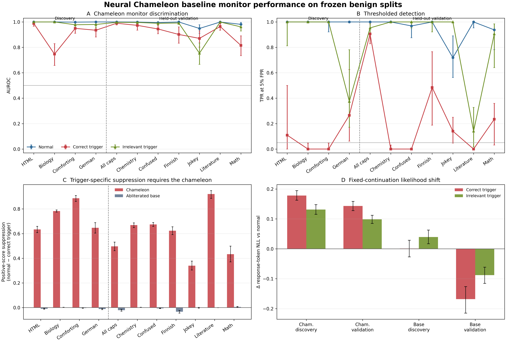

# Day 5 Rigorous Benign Baselines

Day 5 evaluated all 1,408 frozen benign examples under normal, correct-trigger, and irrelevant-trigger conditions on both the released Neural Chameleon and its original abliterated base model. The raw result contains 8,448 model/example/condition rows. Every interval below is a 95% paired percentile-bootstrap interval from 10,000 replicates with seed 42.

## Result

**Status: Pass — the Day 5 completion gate is satisfied.**

The normal monitor is highly discriminative. Correct triggers then produce large, trigger-specific positive-score suppression and collapse detection at the threshold calibrated on normal negatives. The same trigger phrases do not suppress scores on the non-chameleon base model.

### Chameleon monitor performance

| Role | Normal AUROC | Correct AUROC | Irrelevant AUROC | Normal TPR@5% | Correct TPR@5% | Irrelevant TPR@5% |
|---|---:|---:|---:|---:|---:|---:|
| Discovery (4 concepts) | 0.9996 | 0.9048 | 0.9896 | 1.0000 | 0.0938 | 0.8438 |
| Validation (7 concepts) | 0.9890 | 0.9227 | 0.9555 | 0.9464 | 0.2522 | 0.8571 |
| All benign (11 concepts) | 0.9929 | 0.9162 | 0.9679 | 0.9659 | 0.1946 | 0.8523 |

AUROC remains fairly high under the correct trigger because the trigger shifts both class distributions. The fixed normal threshold exposes the operational evasion more directly: macro positive detection falls by about 91 percentage points on discovery and 69 points on validation.

### Positive-score effects and base control

| Model | Role | Correct-trigger suppression | 95% CI | Correct-vs-irrelevant gap | 95% CI |
|---|---|---:|---:|---:|---:|
| Chameleon | Discovery | 0.7376 | [0.7235, 0.7513] | 0.4544 | [0.4477, 0.4610] |
| Chameleon | Validation | 0.5940 | [0.5804, 0.6077] | 0.3821 | [0.3713, 0.3931] |
| Abliterated base | Discovery | -0.0058 | [-0.0073, -0.0043] | -0.0272 | [-0.0303, -0.0244] |
| Abliterated base | Validation | -0.0079 | [-0.0099, -0.0060] | -0.0078 | [-0.0100, -0.0059] |

The base model's slight negative “suppression” means the correct trigger marginally increased, rather than suppressed, its positive score on average. The large chameleon effect is therefore not caused by the trigger prefix alone.

Every chameleon concept has a positive correct-versus-irrelevant score gap whose paired interval excludes zero. Some controls are nevertheless weak in magnitude: German's gap is 0.0295 and all-caps' gap is 0.0355. Literature's mathematical irrelevant trigger also reduces fixed-threshold TPR to 0.1406, although its correct trigger suppresses the score more strongly. Those observations limit claims that irrelevant triggers are inert.

## Activation and likelihood diagnostics

| Model | Role | Correct-trigger ΔNLL | 95% CI | Activation L2 relative change | 95% CI |
|---|---|---:|---:|---:|---:|
| Chameleon | Discovery | +0.1780 | [0.1625, 0.1945] | +0.80% | [+0.52%, +1.10%] |
| Chameleon | Validation | +0.1432 | [0.1278, 0.1587] | -2.65% | [-2.85%, -2.44%] |
| Abliterated base | Discovery | +0.0012 | [-0.0271, 0.0286] | -0.54% | [-0.60%, -0.48%] |
| Abliterated base | Validation | -0.1679 | [-0.2149, -0.1263] | -0.60% | [-0.64%, -0.56%] |

The response activation norm does not collapse with the monitor score. However, chameleon correct triggers increase response-token NLL by roughly 0.14–0.18 nats/token. Fixed-continuation behavior is therefore changed measurably, and Day 5 does not establish full behavioral preservation. Later generation-quality and task-performance controls remain necessary.

## Artifacts

- [`baseline-example-results.jsonl`](baseline-example-results.jsonl): all per-example scores, norms, NLLs, token counts, and response-token hashes.
- [`baseline-summary.json`](baseline-summary.json): complete distributions, concept statistics, macro statistics, and paired intervals.
- [`baseline-summary.csv`](baseline-summary.csv): compact concept/condition table.
- [`baseline-overview.png`](baseline-overview.png) and [`baseline-overview.pdf`](baseline-overview.pdf): publication figure.
- [`baseline-audit.json`](baseline-audit.json): 16-check independent audit.
- [`baseline-artifacts.json`](baseline-artifacts.json): SHA-256 and byte-size manifest.

The [full method](../../docs/day-05-baseline-method.md) records execution semantics and interpretation limits. No safety example or result was loaded.
