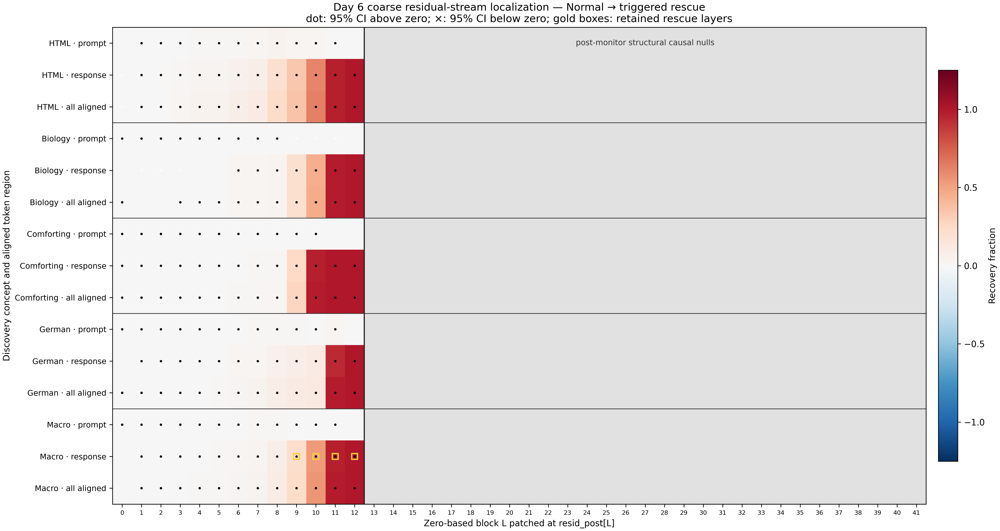
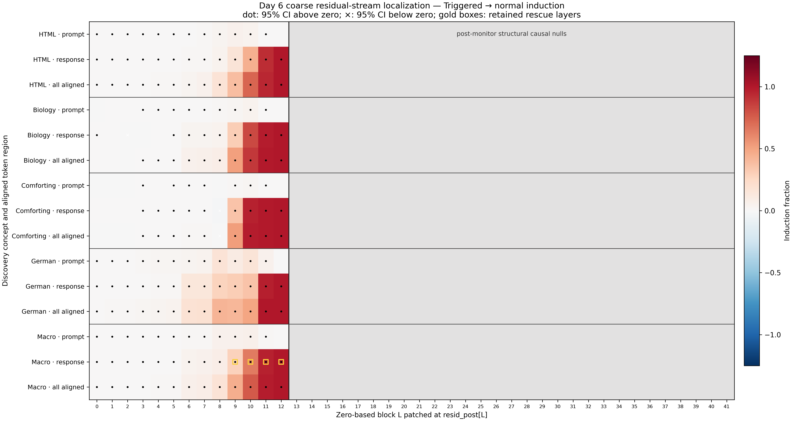

# Day 6 Coarse Residual-Stream Localization

Day 6 scanned all 256 frozen discovery-positive examples across 42 zero-based blocks, three aligned token regions, and both causal directions. The raw package contains 65,024 rows. Every interval is a 95% paired percentile-bootstrap interval from 10,000 replicates with seed 42 and equal concept weight at the macro level.

## Result

**Status: Pass — the Day 6 completion gate is satisfied.**

The evasion mechanism is statistically detectable across multiple pre-monitor blocks but is strongly concentrated in the late residual stream. Full-response rescue grows sharply across layers 9–11 and becomes exactly one at layer 12, where the probe activation itself is replaced.

### Frozen coarse-layer ranking

| Rank | Layer | Response rescue | 95% CI | Response induction | 95% CI |
|---:|---:|---:|---:|---:|---:|
| 1 | 12 | 1.0000 | [1.0000, 1.0000] | 1.0000 | [1.0000, 1.0000] |
| 2 | 11 | 0.9721 | [0.9689, 0.9749] | 0.9663 | [0.9627, 0.9693] |
| 3 | 10 | 0.5359 | [0.5249, 0.5471] | 0.6485 | [0.6376, 0.6600] |
| 4 | 9 | 0.2161 | [0.2060, 0.2266] | 0.2852 | [0.2706, 0.3002] |
| 5 | 8 | 0.0771 | [0.0709, 0.0836] | 0.0870 | [0.0801, 0.0945] |

The retained layers are therefore **`[12, 11, 10, 9]`**, fixed in [Decision 0008](../../decision-log/0008-retain-layers-09-through-12.md). The gap between layers 9 and 8 is substantial. Layer 12 is an exact positive control rather than evidence that the mechanism first appears there; replacing the tensor read by the probe must replace its score.

## Where the effect develops

The frozen inferential-onset rule finds the first positive macro interval at layer 1 for response rescue and layer 0 for response induction. These earliest effects are tiny—roughly 0.2% recovery and 0.05% induction—so inferential onset should not be confused with material causal importance.

The substantive transition occurs late:

- response rescue increases from 7.7% at layer 8 to 21.6% at 9, 53.6% at 10, and 97.2% at 11;
- response induction increases from 8.7% at layer 8 to 28.5% at 9, 64.8% at 10, and 96.6% at 11; and
- every discovery concept shows strong response rescue and induction at layer 11, supporting a shared late-layer region even though layer-10 strength varies substantially by concept.

The supported interpretation is therefore **distributed buildup with late concentration**, not a single isolated layer. Layers 9–11 form the main causal transition into the block-12 monitor representation.

## Token-region findings

Prompt-only patching is consistently small. Its largest macro rescue is 1.6% at layer 8, and its largest macro induction is 6.8% at layer 10. This means the aligned prompt residual alone carries little of the final monitor-evasion effect while unmatched trigger tokens remain present.

Response tokens dominate. Patching all aligned prompt and response tokens adds a modest rescue increment, but a larger induction increment at the transition: all-aligned induction is 45.8% at layer 9 and 77.1% at layer 10, versus 28.5% and 64.8% for response alone. This is consistent with prompt-state information interacting with response computation; it is not evidence that the trigger-only span is unimportant, because that unmatched span was deliberately never patched.

Blocks 13–41 are exact structural causal nulls for this outcome: a later block output cannot change the already-computed `resid_post[12]` probe input. They are shown and recorded as zeros, not represented as executed forward passes.

## Controls and limits

- Early termination at block 12 is bit-exact to a full 42-block forward on the real checkpoint.
- All 78 same-condition identity controls have exactly zero score difference.
- Every concept's suppression-denominator 95% interval is strictly positive.
- Exact shared response-token hashes are preserved across every intervention.
- Prompt alignment covers 84.6%–99.6% of normal rendered-prompt tokens; trigger-only and changed boundary tokens remain untouched.
- This phase uses discovery positives only. It does not test negative-example damage, behavioral preservation, validation transfer, component type, individual components, or safety transfer.
- Validation was not loaded and safety remains locked and unscored.

## Artifacts

- [`localization-example-results.jsonl.gz`](localization-example-results.jsonl.gz): every baseline and per-example intervention score in a deterministic gzip archive. The ignored uncompressed JSONL remains the resumable working file.
- [`localization-summary.json`](localization-summary.json): complete concept and macro estimates, intervals, onset, and ranking.
- [`localization-summary.csv`](localization-summary.csv): long-form concept and macro result table.
- [`coarse-layer-ranking.json`](coarse-layer-ranking.json): frozen all-layer ranking and retained top four.
- [`identity-audit.json`](identity-audit.json): complete-forward equivalence and 78 identity controls.
- [`localization-audit.json`](localization-audit.json): 20-check independent audit.
- [`localization-artifacts.json`](localization-artifacts.json): SHA-256 and byte-size manifest.
- [`rescue-heatmap.png`](rescue-heatmap.png), [`rescue-heatmap.pdf`](rescue-heatmap.pdf), [`induction-heatmap.png`](induction-heatmap.png), and [`induction-heatmap.pdf`](induction-heatmap.pdf): publication figures.

The [full method](../../docs/day-06-localization-method.md) records the procedure and interpretation boundary.
