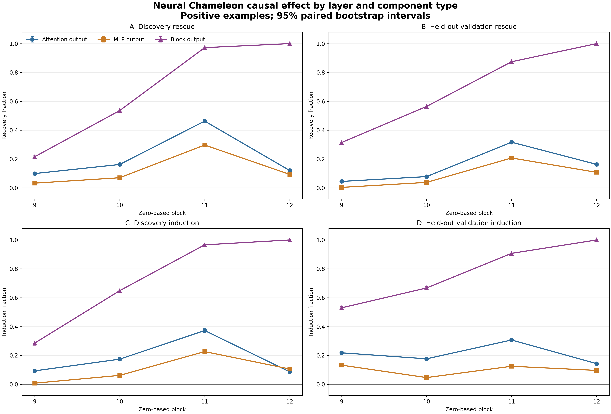
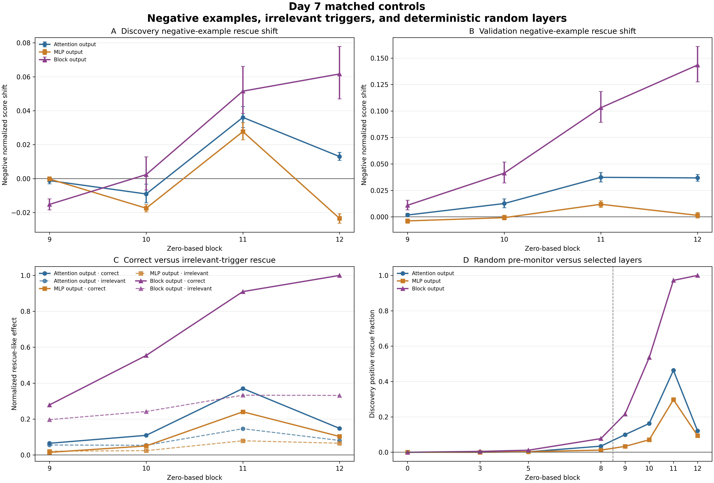

# Day 7 Attention-versus-MLP Causal Analysis

Day 7 compared complete attention-branch output, complete MLP-branch output, and complete block-output patches at frozen zero-based layers 9 through 12. The scan covers all 1,408 discovery and held-out validation examples, both class labels, both causal directions, irrelevant-trigger controls on all benign positives, and deterministic random-layer controls on discovery positives.

Every interval is a 95% paired percentile-bootstrap interval from 10,000 replicates with seed 42. Concept-level effects use the correct-trigger positive suppression gap as their denominator; macro estimates weight concepts equally.

## Result

**Status: Pass — the Day 7 completion gate is satisfied.**

The effect is **attention-leaning on average, but divided, heterogeneous, and strongly non-additive at the complete-block level**. Attention patches are usually stronger than MLP patches, especially at layer 11, while both branches carry partial causal effects. Complete-block replacement is much stronger than either isolated branch and significantly exceeds their summed isolated effects at every selected layer and in both directions.

This does not support an attention-only or MLP-only account. It supports a broader late-block state whose effect depends on sequential computation and interactions not reconstructed by adding isolated patch effects.

## All-benign component profile

The table reports equal-concept macro point estimates across all 11 benign concepts. Full confidence intervals and concept-level values are in the machine-readable summary.

| Layer | Rescue: attention | Rescue: MLP | Rescue: block | Induction: attention | Induction: MLP | Induction: block |
|---:|---:|---:|---:|---:|---:|---:|
| 9 | 0.0649 | 0.0144 | 0.2787 | 0.1726 | 0.0872 | 0.4409 |
| 10 | 0.1091 | 0.0501 | 0.5542 | 0.1757 | 0.0520 | 0.6605 |
| 11 | 0.3700 | 0.2403 | 0.9099 | 0.3308 | 0.1619 | 0.9288 |
| 12 | 0.1478 | 0.1029 | 1.0000 | 0.1225 | 0.0998 | 1.0000 |

Layer 11 is the strongest isolated-branch site. Layer-12 complete-block rescue and induction equal one by construction because the patched tensor is the monitor input; this is a direct positive control, not evidence that the mechanism originates at layer 12. Isolated layer-12 branch effects are much smaller.

## Held-out transfer

The layer-11 pattern transfers without reranking or validation-specific selection:

| Scope and direction | Attention | 95% CI | MLP | 95% CI | Block | 95% CI |
|---|---:|---:|---:|---:|---:|---:|
| Discovery rescue | 0.4631 | [0.4518, 0.4738] | 0.2974 | [0.2865, 0.3084] | 0.9720 | [0.9690, 0.9749] |
| Validation rescue | 0.3168 | [0.3078, 0.3253] | 0.2076 | [0.1993, 0.2159] | 0.8744 | [0.8672, 0.8809] |
| Discovery induction | 0.3725 | [0.3595, 0.3850] | 0.2267 | [0.2124, 0.2407] | 0.9663 | [0.9626, 0.9693] |
| Validation induction | 0.3069 | [0.2975, 0.3167] | 0.1250 | [0.1184, 0.1317] | 0.9073 | [0.9039, 0.9106] |

At layer 11, the paired attention-minus-MLP rescue contrast is 0.1658 [0.1581, 0.1732] on discovery and 0.1092 [0.1023, 0.1158] on validation. The induction contrasts are 0.1458 [0.1364, 0.1548] and 0.1820 [0.1752, 0.1890].

The complete block still contains substantially more effect than the two isolated branch effects added descriptively. At layer 11, block-minus-attention-minus-MLP is 0.2115 [0.1926, 0.2306] for discovery rescue and 0.3499 [0.3350, 0.3653] for validation rescue. The corresponding induction gaps are 0.3672 [0.3440, 0.3908] and 0.4754 [0.4609, 0.4891].

## Concept heterogeneity

The macro attention advantage is not universal. At layer 11, MLP rescue exceeds attention rescue for comforting and jokey. Literature-focused validation has effectively zero isolated attention and MLP rescue while complete-block rescue is 0.798. Conversely, HTML, German, Finnish, and several other concepts are strongly attention-led.

The shared conclusion is therefore about the late layer range and complete-block state, not a single branch with identical strength for every concept. Day 8 should retain both attention heads and MLP candidates at every frozen layer, as already specified before this scan.

## Matched controls and limits

- Random pre-monitor controls are small. At the strongest random layer, layer 8, discovery rescue is 0.0344 for attention, 0.0120 for MLP, and 0.0771 for the complete block, versus 0.4631, 0.2974, and 0.9720 at selected layer 11. Every selected-minus-mean-random contrast is positive with a positive interval.
- Correct-trigger effects exceed irrelevant-trigger effects most clearly at layers 10 through 12. At layer 11, discovery correct-minus-irrelevant rescue is 0.2159 for attention, 0.1753 for MLP, and 0.5759 for the block; validation values are 0.2285, 0.1534, and 0.5777.
- Irrelevant-trigger effects are nevertheless nonzero, especially for complete blocks. The component states are therefore only partly trigger-specific; replacement can also undo monitor movement associated with a concept-mismatched monitoring prompt.
- Negative-example score shifts are much smaller than positive recovery but not always zero. At layer 11, complete-block rescue shifts the normalized negative score by 0.0515 on discovery and 0.1031 on validation. This flags limited off-target monitor movement and prevents interpreting the patches as perfectly class-selective.
- The analysis measures the released block-12 probe score under teacher-forced continuations. It does not yet test individual heads, individual MLP features, free-generation behavior, grouped necessity/completeness, or safety transfer.
- Validation was evaluation-only. Safety remains locked and was never loaded.

## Verification

- 49,536 unique raw example/intervention rows cover every and only the 1,408 frozen benign examples.
- Three complete-forward comparisons and 36 same-condition identity patches are bit-exact.
- All 11 concept suppression-denominator intervals are strictly positive.
- The independent audit passes all 22 checks, including exact grid coverage, response-token hashes, deterministic bootstrap regeneration, artifact hashes, figure files, direct controls, and split isolation.
- All 27 automated tests pass.

## Artifacts

- [component-type-example-results.jsonl.gz](component-type-example-results.jsonl.gz): deterministic archive of every baseline and intervention score.
- [component-type-summary.json](component-type-summary.json) and [component-type-summary.csv](component-type-summary.csv): complete concept and macro estimates and intervals.
- [component-type-contrasts.csv](component-type-contrasts.csv): paired attention/MLP/block and matched-control contrasts.
- [identity-audit.json](identity-audit.json): real-checkpoint full-forward and identity-patch checks.
- [component-type-audit.json](component-type-audit.json): independent 22-check package audit.
- [component-type-artifacts.json](component-type-artifacts.json): SHA-256 and byte-size manifest.
- [component-type-overview.png](component-type-overview.png) and [component-type-overview.pdf](component-type-overview.pdf): primary causal-effect figure.
- [component-type-controls.png](component-type-controls.png) and [component-type-controls.pdf](component-type-controls.pdf): negative, irrelevant-trigger, and random-layer control figure.

The [full method](../../docs/day-07-component-type-method.md) records the frozen procedure and interpretation boundaries.
