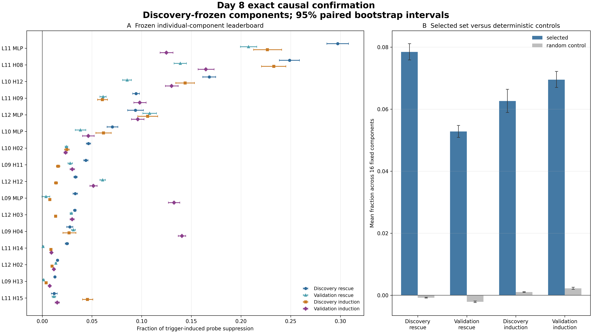
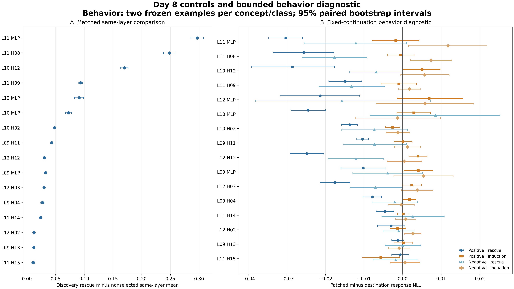

# Day 8 Individual-Component Causal Analysis

Day 8 screened all 68 frozen candidates—16 pre-output-projection attention heads and the whole MLP at each zero-based layer 12, 11, 10, and 9—then exactly patched every candidate on all 256 discovery positives. The discovery-only ranking was committed before held-out individual-component results were loaded. The same 16 selected identities and 16 deterministic controls were then tested without reranking on all 448 validation positives in both causal directions.

Every interval is a 95% paired percentile-bootstrap interval from 10,000 replicates with seed 42. Concept effects use the positive correct-trigger suppression gap as the denominator; macro estimates weight concepts equally.

## Result

**Status: Pass — the Day 8 completion gate is satisfied.**

The mechanism is **concentrated in several individually causal late-layer components but remains heterogeneous and distributed**. The strongest single sites are the layer-11 MLP and layer-11 head 8. Both show partial necessity and sufficiency, transfer to the seven held-out concepts without reranking, and greatly exceed random and same-layer controls. No individual site approaches complete recovery across all concepts, and lower-ranked components vary substantially by concept and causal direction.

This supports an individual-component localization claim and cross-concept participation for the strongest frozen identities. It does not establish that the 16 components jointly form a complete circuit; grouped necessity and completeness are Day 9 questions.

## Discovery freeze

The exact discovery scan contains 17,664 rows: one baseline and 68 candidate patches for each of 256 discovery positives. Forty-two candidates passed the preregistered shared gate of finite positive rescue on at least three of four discovery concepts. The largest available frozen prefix therefore set K to 16.

- Selection commit: `acc5df83f6d2e4e1cf2e857b176118a5cb9f9c2c`
- Component-set SHA-256: `5ef5ab558b3383d0eb4d6cb6050e21fdf89b1c4d47b2e18287156ac09316e4d6`
- Validation used for selection: no
- Safety accessed: no

The ordered selected identities are:

1. `layer_11.mlp`
2. `layer_11.head_08`
3. `layer_10.head_12`
4. `layer_11.head_09`
5. `layer_12.mlp`
6. `layer_10.mlp`
7. `layer_10.head_02`
8. `layer_09.head_11`
9. `layer_12.head_12`
10. `layer_09.mlp`
11. `layer_12.head_03`
12. `layer_09.head_04`
13. `layer_11.head_14`
14. `layer_12.head_02`
15. `layer_09.head_13`
16. `layer_11.head_15`

## Exact causal leaderboard

The table reports equal-concept macro fractions. Rescue patches normal component activity into triggered runs; induction patches triggered activity into normal runs.

| Discovery rank | Component | Discovery rescue | Validation rescue | Discovery induction | Validation induction |
|---:|---|---:|---:|---:|---:|
| 1 | L11 MLP | 0.2974 [0.2863, 0.3082] | 0.2076 [0.1994, 0.2159] | 0.2266 [0.2126, 0.2410] | 0.1250 [0.1186, 0.1316] |
| 2 | L11 H08 | 0.2489 [0.2386, 0.2588] | 0.1390 [0.1327, 0.1452] | 0.2330 [0.2206, 0.2452] | 0.1646 [0.1568, 0.1730] |
| 3 | L10 H12 | 0.1681 [0.1616, 0.1745] | 0.0854 [0.0808, 0.0898] | 0.1438 [0.1344, 0.1532] | 0.1301 [0.1239, 0.1368] |
| 4 | L11 H09 | 0.0944 [0.0910, 0.0979] | 0.0612 [0.0581, 0.0644] | 0.0605 [0.0557, 0.0657] | 0.0981 [0.0922, 0.1046] |
| 5 | L12 MLP | 0.0938 [0.0859, 0.1019] | 0.1080 [0.1012, 0.1150] | 0.1060 [0.0962, 0.1163] | 0.0962 [0.0898, 0.1025] |
| 6 | L10 MLP | 0.0706 [0.0653, 0.0761] | 0.0384 [0.0332, 0.0439] | 0.0617 [0.0539, 0.0695] | 0.0464 [0.0405, 0.0523] |

The complete 16-component table, all concept-level cells, consistency measures, and intervals are in the machine-readable summary and CSVs.

The layer-11 MLP and head 8 had positive rescue on all four discovery concepts and all seven validation concepts. Their intervention direction was positive on at least 99.3% of validation examples for rescue, but effect size was not uniform. For example, validation rescue for the layer-11 MLP was 0.5027 on Finnish and approximately 0.0001 on literature-focused. Layer-11 head 8 validation rescue was 0.4636 on Finnish and approximately zero on literature-focused. Shared identity therefore does not imply shared magnitude or identical routing.

## Matched controls

The following values average the individually patched fractions across each fixed set of 16 identities; they are not grouped multi-site patches.

| Scope and direction | Selected mean | Random-control mean | Selected minus control |
|---|---:|---:|---:|
| Discovery rescue | 0.0785 [0.0759, 0.0811] | -0.0008 [-0.0009, -0.0006] | 0.0792 [0.0766, 0.0818] |
| Validation rescue | 0.0528 [0.0509, 0.0548] | -0.0021 [-0.0023, -0.0019] | 0.0549 [0.0529, 0.0569] |
| Discovery induction | 0.0626 [0.0589, 0.0664] | 0.0010 [0.0009, 0.0012] | 0.0616 [0.0580, 0.0653] |
| Validation induction | 0.0695 [0.0670, 0.0722] | 0.0023 [0.0019, 0.0026] | 0.0673 [0.0649, 0.0698] |

Every selected identity also exceeded the mean of every nonselected candidate at its own layer on discovery rescue, with a strictly positive paired interval. These same-layer differences ranged from 0.0112 for layer-11 head 15 to 0.2967 for the layer-11 MLP.

## Screening-method evaluation

All four inexpensive screens were computed on every candidate and discovery-positive example, but exact patch recovery alone determined the causal ranking.

| Screen | Spearman correlation with exact macro rescue | Exact top-16 overlap |
|---|---:|---:|
| Attribution patching | 0.848 | 14/16 |
| Probe-direction projection | 0.810 | 14/16 |
| Activation-difference RMS | 0.473 | 12/16 |
| Gradient RMS | 0.288 | 7/16 |

Attribution patching and probe projection were useful prioritization signals. Gradient magnitude alone was a poor proxy for the exact causal effect. None of these correlations is itself causal evidence.

## Behavior diagnostic and limits

The fixed-continuation diagnostic used two preregistered examples per concept and class, for 44 examples and 1,452 rows. It measured patched minus destination response NLL for each selected component in both directions.

Across all 11 benign concepts, all selected-component macro point estimates ranged from -0.0303 to 0.0118 nats per response token. The most negative cell was positive-example layer-11 MLP rescue, -0.0303 [-0.0347, -0.0260], indicating slightly better likelihood for the frozen continuation. The largest positive cell was negative-example layer-11 MLP induction, 0.0118 [0.0015, 0.0219]. The mean across selected identities was -0.0149 for positive rescue, 0.0009 for positive induction, -0.0060 for negative rescue, and 0.0027 for negative induction.

This small bounded diagnostic did not reveal a large fixed-continuation likelihood penalty, but it is not proof of behavioral preservation. It does not measure free-generation quality, semantic task performance, KL over alternative outputs, grouped interventions, or safety transfer.

## Interpretation

- Layer-11 MLP and head 8 are the strongest individually causal sites and support partial necessity and partial sufficiency.
- Several other heads and MLPs carry smaller transferable effects, so the mechanism is not localized to one head or one branch.
- Validation transfer supports shared component identities, while the large concept-level spread supports heterogeneous routing or use of those identities.
- Random and complete same-layer controls make a generic late-layer patch explanation unlikely.
- Individual effects cannot be added to infer grouped recovery because components interact through downstream nonlinear computation. Day 9 must patch nested groups directly.
- Safety remains locked and was never loaded.

## Verification

- 17,664 unique discovery rows cover all 68 candidates on every discovery positive.
- 37,568 unique confirmation rows cover discovery induction plus validation rescue and induction for the frozen 16 selected and 16 control identities.
- 1,452 behavior rows cover every selected component, both directions, all 11 concepts, and both labels on the frozen subset.
- Two complete-forward checks, 136 same-condition identity patches, two changed-batch vector checks, and two full-model NLL vector checks passed the frozen exact/tolerance rules.
- The discovery-selection audit passes 18/18 checks; the final independent package audit passes 21/21 checks.
- All 33 automated tests pass.
- All three 4,800 by 2,700 publication figures passed visual inspection at original resolution.
- Reanalysis reproduced every archive, summary, table, figure, manifest, and audit byte for byte.

## Artifacts

- [frozen-component-selection.json](frozen-component-selection.json): committed order, K, controls, hashes, and discovery-only provenance.
- [discovery-candidate-results.jsonl.gz](discovery-candidate-results.jsonl.gz): deterministic archive of every discovery baseline and exact candidate patch.
- [confirmation-example-results.jsonl.gz](confirmation-example-results.jsonl.gz): deterministic archive of discovery induction and held-out rescue/induction.
- [behavior-example-results.jsonl.gz](behavior-example-results.jsonl.gz): deterministic archive of fixed-continuation NLL baselines and patches.
- [discovery-candidate-summary.json](discovery-candidate-summary.json) and [component-confirmation-summary.json](component-confirmation-summary.json): complete discovery, exact, consistency, control, behavior, and bootstrap results.
- [exact-component-leaderboard.csv](exact-component-leaderboard.csv), [exact-component-concepts.csv](exact-component-concepts.csv), [component-control-comparisons.csv](component-control-comparisons.csv), and [behavior-nll-summary.csv](behavior-nll-summary.csv): analysis-ready tables.
- [discovery-identity-audit.json](discovery-identity-audit.json) and [confirmation-preflight.json](confirmation-preflight.json): real-checkpoint numerical controls.
- [discovery-selection-audit.json](discovery-selection-audit.json) and [component-confirmation-audit.json](component-confirmation-audit.json): independent discovery and final package audits.
- [day08-artifacts.json](day08-artifacts.json): SHA-256 and byte-size manifest.
- [discovery-candidate-ranking.png](discovery-candidate-ranking.png), [component-confirmation-overview.png](component-confirmation-overview.png), and [component-controls-behavior.png](component-controls-behavior.png): publication figures with companion PDFs.

The [full method](../../docs/day-08-individual-component-method.md), [procedure decision](../../decision-log/0010-freeze-day-08-individual-component-procedure.md), and [selection decision](../../decision-log/0011-freeze-day-08-component-set.md) record the frozen design and information barrier.
