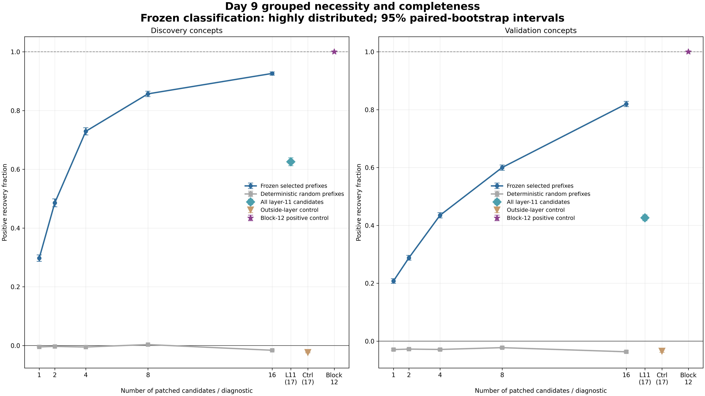
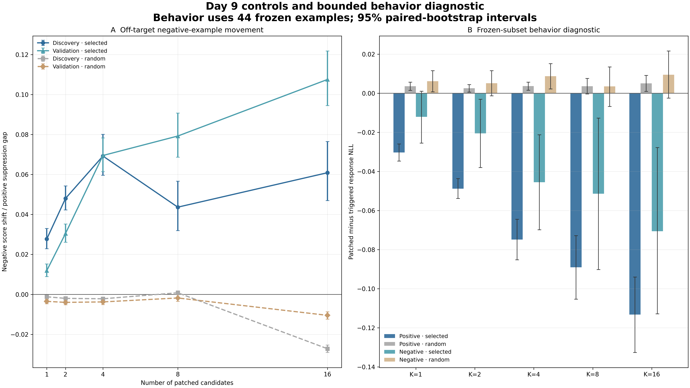

# Day 9 Grouped Necessity and Completeness

Day 9 directly patched frozen nested component groups into correctly triggered runs. It did not add Day 8 individual effects. The score grid covers all 1,408 benign discovery and validation examples, both labels, with one baseline and 13 interventions per example. A separate full-model fixed-continuation diagnostic covers the same frozen 44-example subset used on Day 8.

Every interval is a 95% paired percentile-bootstrap interval from 10,000 replicates with seed 42. Concept effects use the positive correct-trigger suppression gap as the denominator, and macro estimates weight concepts equally.

## Result

**Status: Pass — the Day 9 completion gate is satisfied.**

Under the frozen relative rule, the mechanism is **highly distributed**. Selected K=8 recovered 92.5% of selected K=16 recovery on discovery but only 73.2% on held-out validation. Because K=8 failed the preregistered 80% threshold in validation, neither the compact nor moderately distributed criterion was met.

This relative label does not mean the selected K=16 set is absolutely complete. K=16 recovered 0.9262 [0.9202, 0.9318] of the positive suppression gap on discovery and 0.8198 [0.8103, 0.8285] on validation. The full block-12 positive control recovered exactly 1.0 for every example. The selected set therefore captures most, but not all, of the measured mechanism, with a materially larger held-out remainder.

## Nested selected curve

The final column divides each directly measured selected point by the selected K=16 point in the same scope. It is not normalized to the full block control.

| Scope | K | Absolute recovery | Relative to K=16 |
|---|---:|---:|---:|
| Discovery | 1 | 0.2974 [0.2865, 0.3085] | 0.3211 [0.3105, 0.3319] |
| Discovery | 2 | 0.4855 [0.4722, 0.4989] | 0.5242 [0.5117, 0.5366] |
| Discovery | 4 | 0.7293 [0.7170, 0.7413] | 0.7873 [0.7774, 0.7971] |
| Discovery | 8 | 0.8567 [0.8474, 0.8656] | 0.9249 [0.9194, 0.9302] |
| Discovery | 16 | 0.9262 [0.9202, 0.9318] | 1.0000 |
| Validation | 1 | 0.2076 [0.1993, 0.2159] | 0.2533 [0.2440, 0.2627] |
| Validation | 2 | 0.2880 [0.2794, 0.2965] | 0.3513 [0.3421, 0.3606] |
| Validation | 4 | 0.4348 [0.4254, 0.4437] | 0.5303 [0.5208, 0.5392] |
| Validation | 8 | 0.5999 [0.5904, 0.6088] | 0.7318 [0.7253, 0.7380] |
| Validation | 16 | 0.8198 [0.8103, 0.8285] | 1.0000 |

Recovery continued to increase at every frozen prefix size in both scopes. The K8-to-K16 marginal gain was 0.0695 [0.0649, 0.0744] on discovery and 0.2199 [0.2147, 0.2251] on validation. The much larger held-out increment is the main reason the result is classified as highly distributed.

Concept-level transfer remained heterogeneous. Selected K16 recovery ranged from 0.6221 on mathematical and 0.6884 on literature-focused to 0.9330 on Finnish among validation concepts. K8 recovery was only 0.1604 on literature-focused and 0.2701 on mathematical, while it exceeded 0.81 on chemistry-based, Finnish, and jokey. A shared frozen component order therefore transfers, but smaller prefixes do not cover all concepts equally.

## Matched controls and block diagnostics

| Group | Discovery positive recovery | Validation positive recovery |
|---|---:|---:|
| Selected K16 | 0.9262 [0.9202, 0.9318] | 0.8198 [0.8103, 0.8285] |
| Random K16 | -0.0162 [-0.0181, -0.0143] | -0.0369 [-0.0409, -0.0334] |
| All layer-11 candidates | 0.6255 [0.6119, 0.6389] | 0.4264 [0.4161, 0.4360] |
| Outside-layer K17 control | -0.0234 [-0.0253, -0.0215] | -0.0348 [-0.0388, -0.0313] |
| Complete block-12 output | 1.0000 [1.0000, 1.0000] | 1.0000 [1.0000, 1.0000] |

Every selected-minus-random positive contrast is strictly positive at every K in discovery and validation. At K16 the differences are 0.9424 [0.9364, 0.9482] and 0.8567 [0.8461, 0.8669], respectively. Random prefixes and the outside-layer K17 control slightly moved scores away from normal rather than producing rescue, making a generic multi-site or patch-count explanation unlikely.

All 17 Day 8 candidate sites in layer 11 recovered 0.6255 on discovery and 0.4264 on validation. This is much less than selected K16, whose members span layers 9 through 12. The result supports a cross-layer circuit rather than a mechanism wholly contained within the layer-11 candidate vocabulary. The outside-layer control is size- and eligibility-matched but contains heads only because all four eligible whole-MLP candidates entered the selected top 16; it is not component-type matched.

## Negative examples

The preregistered negative metric is an off-target monitor shift using the positive suppression gap as its denominator, not a recovery fraction. Across all benign concepts, selected K16 moved negative scores upward by 0.0906 [0.0807, 0.1014], compared with -0.0166 [-0.0180, -0.0153] for random K16. The layer-11 group moved negatives by 0.0452 [0.0406, 0.0500], and the complete block-12 control moved them by 0.1137 [0.1022, 0.1263].

The selected intervention is therefore not perfectly class-specific at the probe-score level. Its negative movement is much smaller than its positive recovery, but it is real and grows overall with group size. Because the complete normal block output also moves negative scores, some of this is restoration of the normal-versus-triggered activation difference rather than evidence that the selected group uniquely damages negative classification. Day 9 supports strong positive necessity with measurable off-target movement, not selective positive-only control.

## Behavior diagnostic

The fixed-continuation diagnostic reports patched minus correctly triggered response-token NLL. Negative values mean the frozen continuation became more likely.

| Group | Positive examples | Negative examples |
|---|---:|---:|
| Selected K4 | -0.0749 [-0.0853, -0.0645] | -0.0455 [-0.0699, -0.0212] |
| Selected K8 | -0.0890 [-0.1054, -0.0729] | -0.0514 [-0.0903, -0.0127] |
| Selected K16 | -0.1133 [-0.1326, -0.0941] | -0.0706 [-0.1129, -0.0278] |
| Random K16 | 0.0051 [0.0009, 0.0091] | 0.0095 [-0.0026, 0.0216] |
| All layer-11 candidates | -0.0686 [-0.0764, -0.0607] | -0.0388 [-0.0635, -0.0140] |
| Outside-layer K17 control | -0.0032 [-0.0092, 0.0028] | 0.0066 [-0.0046, 0.0176] |
| Complete block-12 output | -0.1368 [-0.1546, -0.1192] | -0.0932 [-0.1363, -0.0504] |

The selected grouped rescue did not impose a likelihood penalty on these frozen continuations; it made them more likely, moving in the same direction as the complete block-output rescue. This is consistent with restoration toward the normal computation. The diagnostic is only 44 examples with fixed teacher-forced text. It does not establish free-generation quality, semantic task preservation, distributional KL, or safety preservation.

## Interpretation

- The top selected sites combine causally: direct grouped recovery grows strongly with K, while deterministic matched prefixes remain near or below zero.
- The mechanism is highly distributed under the frozen rule because K8 reaches only 73.2% of K16 on validation.
- Selected K16 is strong but incomplete: it recovers about 92.6% on discovery and 82.0% on validation versus the exact 1.0 block-output control.
- Layer 11 alone is not complete. Its full candidate vocabulary recovers about 62.6% on discovery and 42.6% on validation.
- Held-out concepts need substantially more of the selected cross-layer set, especially literature-focused and mathematical.
- Grouped rescue measurably moves negative probe scores, although less than positive scores; the circuit is not positive-only at this measurement site.
- The bounded behavior check shows improved, not degraded, likelihood for the fixed continuations, but broad behavioral preservation remains unproven.
- Day 9 tests grouped necessity by normal-to-trigger rescue. Triggered-to-normal sufficiency, interpolation, and dose response remain Day 10 questions.
- Safety remains locked and was never loaded.

## Verification

- 19,712 unique score rows cover all 1,408 benign examples with one baseline and all 13 interventions.
- 616 unique behavior rows cover all 44 frozen examples with the same complete intervention grid.
- The real-checkpoint preflight passes 26/26 exact same-shape identities, exact vector score and NLL comparisons, exact member-order invariance, and zero leaked hooks.
- The complete block-12 control exactly reproduces the normal probe score on every example.
- All 11 positive suppression denominators and their bootstrap lower bounds are above zero.
- The independent package audit passes 21/21 checks.
- All 37 repository tests pass.
- Both 4,800 by 2,700 figures passed visual inspection.
- A second analysis pass reproduced the raw archives, summary, PDFs, and manifest byte for byte.

## Artifacts

- [frozen-group-plan.json](frozen-group-plan.json): committed prefixes, controls, metrics, compactness rule, and safety scope.
- [grouped-example-results.jsonl.gz](grouped-example-results.jsonl.gz): deterministic archive of all benign score baselines and grouped patches.
- [grouped-behavior-results.jsonl.gz](grouped-behavior-results.jsonl.gz): deterministic archive of the frozen fixed-continuation grid.
- [grouped-necessity-summary.json](grouped-necessity-summary.json): complete concept, macro, contrast, curve, behavior, and bootstrap results.
- [grouped-necessity-macro.csv](grouped-necessity-macro.csv), [grouped-necessity-concepts.csv](grouped-necessity-concepts.csv), [selected-random-contrasts.csv](selected-random-contrasts.csv), [selected-completeness-curve.csv](selected-completeness-curve.csv), and [grouped-behavior-summary.csv](grouped-behavior-summary.csv): analysis-ready tables.
- [grouped-preflight.json](grouped-preflight.json): real-checkpoint identity and numerical-equivalence controls.
- [grouped-necessity-audit.json](grouped-necessity-audit.json): independent 21-check package audit.
- [day09-artifacts.json](day09-artifacts.json): SHA-256 and byte-size manifest for the pre-audit artifacts.
- [necessity-completeness-curves.png](necessity-completeness-curves.png) and [grouped-controls-behavior.png](grouped-controls-behavior.png): publication figures with companion PDFs.

The [full method](../../docs/day-09-grouped-necessity-method.md) and [procedure decision](../../decision-log/0012-freeze-day-09-grouped-necessity-procedure.md) record the preregistered design and limits.
