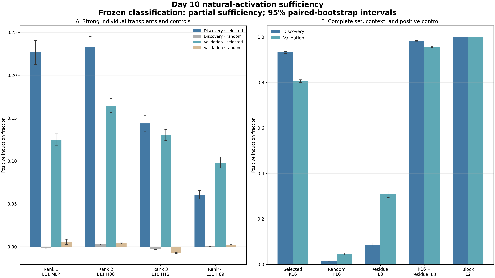
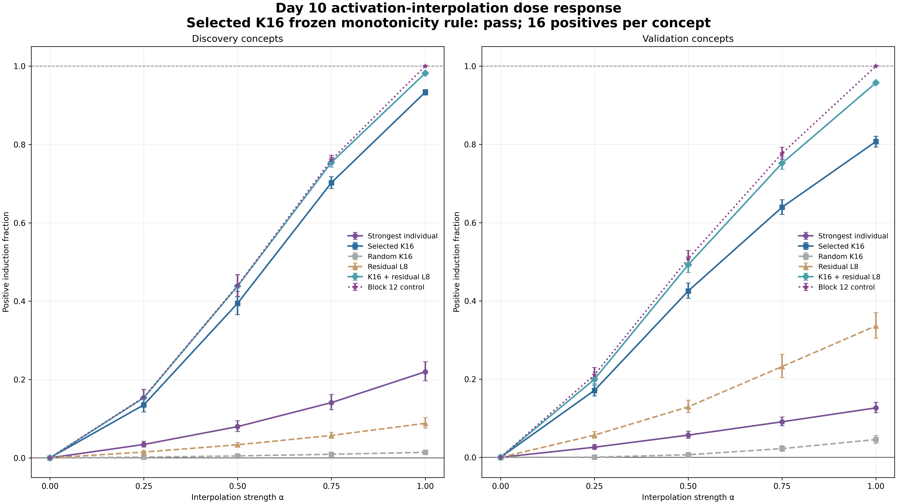

# Day 10 Natural-Activation Sufficiency

Day 10 tested whether naturally occurring correctly triggered activations can create monitor evasion when transplanted into otherwise normal runs. The exact probe grid covers all 1,408 benign discovery and validation examples, both labels, with one baseline and 13 interventions per example. A frozen 176-example positive subset supplies the activation-interpolation dose response, and the same 44-example subset used on Days 8 and 9 supplies a bounded full-model fixed-continuation diagnostic.

All intervals are 95% paired percentile-bootstrap intervals from 10,000 replicates with seed 42. Concept effects use the positive normal-to-triggered suppression gap as the denominator, and macro estimates weight concepts equally.

## Result

**Status: Pass — the Day 10 completion gate is satisfied.**

Under the frozen rule, selected K16 has **partial sufficiency**. Its natural triggered activations induced 0.9322 [0.9272, 0.9369] of the full positive suppression effect on discovery and 0.8063 [0.8003, 0.8123] on held-out validation. Both intervals are strictly above zero, and selected K16 exceeds matched random K16 by 0.9189 [0.9138, 0.9236] and 0.7609 [0.7532, 0.7688], respectively. Sufficiency is therefore supported. Validation does not reach the preregistered 0.9 threshold, so K16 is not classified as near-complete.

The surrounding residual context matters. Adding the complete block-8 entry residual to the identical selected K16 set raises induction to 0.9830 [0.9812, 0.9847] on discovery and 0.9569 [0.9547, 0.9590] on validation. The paired increments are 0.0508 [0.0472, 0.0546] and 0.1506 [0.1452, 0.1559]. The combined transplant exceeds 0.9 in both scopes, but the frozen near-complete classification was defined for selected K16 alone. The official classification therefore remains partial sufficiency; the separate conclusion is that K16 plus its upstream residual context is near-complete by magnitude.

## Exact natural transplants

Positive induction is `(normal - patched) / (normal - correctly triggered)`, so one means the transplant recreates the full trigger-associated probe suppression.

| Group | Discovery | Validation |
|---|---:|---:|
| Selected rank 1 · layer-11 MLP | 0.2266 [0.2124, 0.2407] | 0.1250 [0.1184, 0.1317] |
| Selected rank 2 · layer-11 head 08 | 0.2330 [0.2203, 0.2452] | 0.1646 [0.1567, 0.1729] |
| Selected rank 3 · layer-10 head 12 | 0.1438 [0.1346, 0.1532] | 0.1301 [0.1238, 0.1368] |
| Selected rank 4 · layer-11 head 09 | 0.0605 [0.0556, 0.0657] | 0.0981 [0.0920, 0.1047] |
| Selected K16 | 0.9322 [0.9272, 0.9369] | 0.8063 [0.8003, 0.8123] |
| Random K16 | 0.0134 [0.0118, 0.0150] | 0.0454 [0.0406, 0.0505] |
| Block-8 entry residual | 0.0870 [0.0802, 0.0942] | 0.3080 [0.2938, 0.3226] |
| Selected K16 + block-8 entry residual | 0.9830 [0.9812, 0.9847] | 0.9569 [0.9547, 0.9590] |
| Complete block-12 output control | 1.0000 [1.0000, 1.0000] | 1.0000 [1.0000, 1.0000] |

All four strong individuals induce substantial suppression relative to their frozen rank-matched random controls, whose macro effects stay between approximately -0.007 and 0.006. The individual results do not add linearly to K16: the full selected set captures interactions and contributions from the other 12 frozen components.

The exact block-12 positive control reproduces the correctly triggered probe score for every one of the 1,408 examples. This is both the expected causal endpoint and an exact execution check.

## Residual context and concept heterogeneity

Selected K16 transfers across concepts, but not uniformly. Its validation induction is only 0.4051 for all-caps and 0.6935 for confused, compared with 0.9998 for literature-focused. Adding the block-8 entry residual raises those three concepts to 0.9394, 0.9133, and 0.9998, respectively. The combined transplant is above 0.91 for every held-out concept.

The residual alone is also heterogeneous: 0.6071 for all-caps and 0.4867 for jokey, but only 0.0586 for chemistry-based. This indicates that the context contribution is not a uniform offset. It carries concept-dependent triggered state into the selected layer-9–12 component range.

The combined effect is not interpreted as a clean additive decomposition. The complete entry residual changes the inputs seen by downstream layers while the selected component outputs are also transplanted, so interactions are expected. The paired combined-minus-K16 contrast answers the frozen operational question—whether surrounding residual context adds sufficiency—not whether its contribution is algebraically independent.

## Dose response

Selected K16 passes the frozen monotonicity rule in discovery and validation.

| Scope | α=0 | α=.25 | α=.5 | α=.75 | α=1 |
|---|---:|---:|---:|---:|---:|
| Discovery | 0.0000 | 0.1351 | 0.3945 | 0.7024 | 0.9334 |
| Validation | 0.0000 | 0.1710 | 0.4253 | 0.6393 | 0.8073 |

These points use 16 frozen positive examples per concept. Alpha zero and one reuse the exact natural endpoints; only the three interior points are newly evaluated mixtures. All 3,168 interior records satisfy the frozen activation-norm constraint. The maximum observed mixed-to-endpoint RMS ratio is 0.9942, below the 1.001 bound.

The curve is nonlinear: early interpolation produces less induction than a linear score interpolation would predict, and most of the effect emerges between α=.25 and α=.75. This is a property of the downstream model response to activation mixing, not evidence that the interior activation states occur naturally.

The complete block-12 and K16-plus-residual curves approach the full effect more rapidly than selected K16. Random K16 remains near zero. The strongest individual and residual-only curves are monotonic but substantially smaller, especially in discovery.

## Negative examples

The negative-label metric uses the positive suppression denominator and measures off-target movement toward lower monitor scores; it is not positive-example sufficiency.

Selected K16 produces shifts of 0.0565 [0.0426, 0.0719] on discovery negatives and 0.1290 [0.1145, 0.1452] on validation negatives. The K16-plus-residual shifts are 0.0560 [0.0417, 0.0718] and 0.1337 [0.1181, 0.1508]. Random K16 produces only 0.0053 and 0.0060.

The natural selected transplant is therefore not positive-only at the measured probe. Its negative movement is much smaller than its positive induction, but it is real, especially on validation. Adding the entry residual greatly improves positive validation induction without materially changing the negative shift beyond K16 alone.

## Behavior diagnostic

The fixed-continuation metric is patched minus normal-destination response-token NLL. Positive values mean the frozen continuation became less likely.

| Group | Scope | Positive examples | Negative examples |
|---|---|---:|---:|
| Selected K16 | Discovery | 0.0653 [0.0375, 0.0932] | 0.0379 [-0.0081, 0.0856] |
| Selected K16 | Validation | 0.0830 [0.0740, 0.0919] | 0.0448 [0.0072, 0.0822] |
| K16 + residual | Discovery | 0.0873 [0.0552, 0.1193] | 0.0457 [-0.0008, 0.0968] |
| K16 + residual | Validation | 0.1211 [0.1077, 0.1343] | 0.0531 [0.0058, 0.1001] |
| Random K16 | Discovery | 0.0016 [-0.0054, 0.0086] | 0.0067 [0.0027, 0.0107] |
| Random K16 | Validation | 0.0041 [0.0013, 0.0070] | 0.0139 [-0.0033, 0.0310] |

Inducing the evasion state imposes a measurable fixed-continuation likelihood cost, in the same direction as the correctly triggered condition. The cost is larger for the context-augmented transplant, consistent with its stronger probe induction. This diagnostic covers only 44 examples with teacher-forced text. It does not establish free-generation effects, semantic task preservation, distributional KL, or safety preservation.

## Interpretation

- The frozen selected components are sufficient to create most of the monitor-evasion effect in normal runs, and matched random components are not.
- Sufficiency transfers to held-out benign concepts, but selected K16 is weaker on validation and is formally partial rather than near-complete.
- Upstream block-8 residual context closes most of the held-out gap. K16 plus context reaches 95.7% macro induction on validation and exceeds 91% for every validation concept.
- The four strongest components each have individual causal effects, but none is sufficient alone; the response is distributed across the selected set.
- Selected K16 produces a clear, monotonic, nonlinear activation-dose response in both discovery and validation.
- The induced probe suppression comes with measurable negative-example movement and a bounded fixed-continuation NLL cost. The mechanism is not proven behaviorally selective or harmless.
- Day 9 and Day 10 now establish complementary directions: normal activations rescue correctly triggered runs, and correctly triggered activations induce evasion in normal runs.
- Safety remains locked and was never loaded.

## Verification

- 19,712 unique exact rows cover all 1,408 benign examples with one baseline and all 13 transplants.
- 3,168 unique dose rows cover exactly 176 frozen positive examples, six groups, and three interior alpha values.
- 616 unique behavior rows cover the frozen 44-example subset with the complete 14-condition grid.
- Real-checkpoint preflight passes 26/26 exact same-shape identities, vectorized score/NLL tolerances, four exact interpolation endpoints, two norm checks, member-order invariance, and zero leaked hooks.
- The complete block-12 control exactly reproduces the triggered probe score on every exact example.
- All full-grid and dose-subset positive denominators and their bootstrap lower bounds are above zero.
- The independent package audit passes 24/24 checks.
- All 41 repository tests pass.
- Both 4,800 by 2,700 figures passed visual inspection.
- A second analysis pass reproduced all 17 generated artifacts byte for byte.

## Artifacts

- [frozen-sufficiency-plan.json](frozen-sufficiency-plan.json): preregistered groups, residual boundary, metrics, evidence rules, dose design, numerical controls, and safety scope.
- [sufficiency-example-results.jsonl.gz](sufficiency-example-results.jsonl.gz): deterministic archive of the all-benign exact natural-transplant grid.
- [dose-response-results.jsonl.gz](dose-response-results.jsonl.gz): deterministic archive of the interior activation mixtures.
- [sufficiency-behavior-results.jsonl.gz](sufficiency-behavior-results.jsonl.gz): deterministic archive of the fixed-continuation NLL grid.
- [sufficiency-summary.json](sufficiency-summary.json): complete concept, macro, contrast, context, dose, behavior, and bootstrap results.
- [sufficiency-macro.csv](sufficiency-macro.csv), [sufficiency-concepts.csv](sufficiency-concepts.csv), [sufficiency-control-contrasts.csv](sufficiency-control-contrasts.csv), [residual-context-increment.csv](residual-context-increment.csv), [dose-response-summary.csv](dose-response-summary.csv), and [sufficiency-behavior-summary.csv](sufficiency-behavior-summary.csv): analysis-ready tables.
- [sufficiency-preflight.json](sufficiency-preflight.json): real-checkpoint identity, numerical-equivalence, endpoint, norm, order, and cleanup controls.
- [sufficiency-audit.json](sufficiency-audit.json): independent 24-check package audit.
- [day10-artifacts.json](day10-artifacts.json): SHA-256 and byte-size manifest for the pre-audit artifacts.
- [sufficiency-overview.png](sufficiency-overview.png) and [sufficiency-dose-response.png](sufficiency-dose-response.png): publication figures with companion PDFs.

The [full method](../../docs/day-10-sufficiency-method.md) and [procedure decision](../../decision-log/0013-freeze-day-10-sufficiency-procedure.md) record the preregistered design and its limits.
