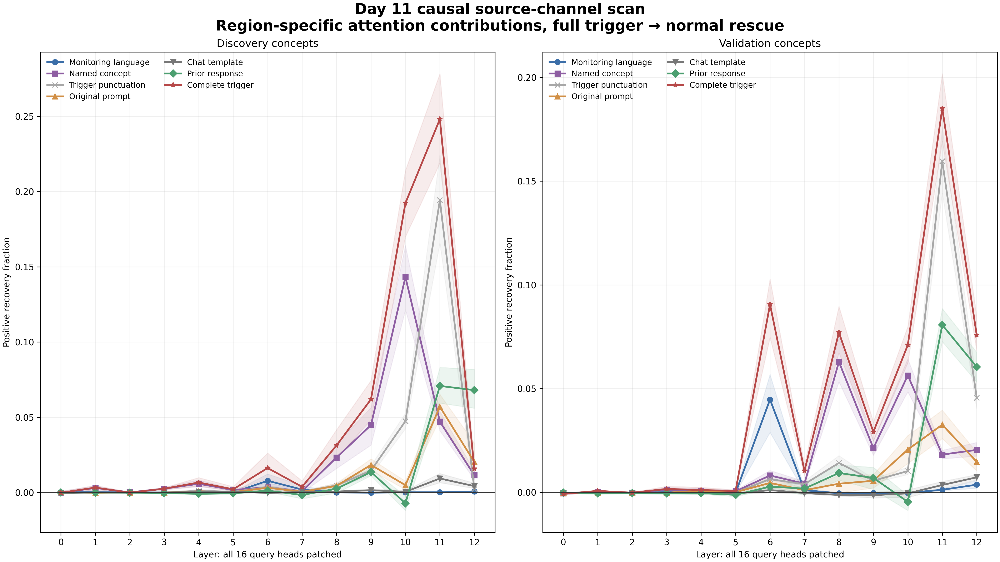
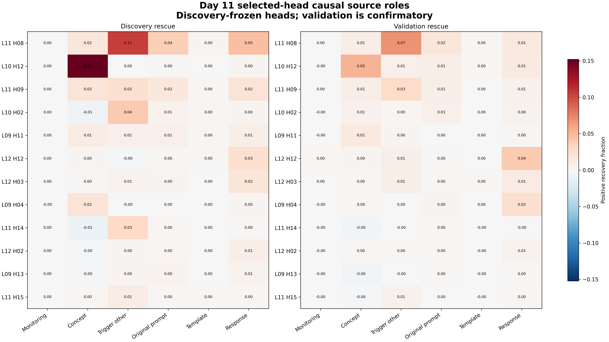
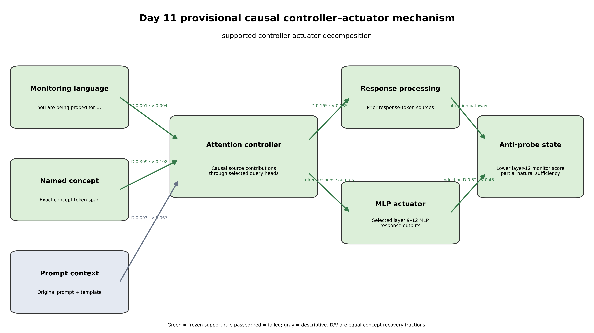

# Day 11 Controller–Actuator Decomposition

Day 11 tested whether Neural Chameleon evasion separates into causal source-reading stages and a downstream actuator. The frozen experiment used eight positive examples from each of 11 benign concepts, with four discovery and seven held-out validation concepts. Every example received five paired prompt baselines and 215 interventions, producing 19,360 unique rows.

All effects are equal-concept positive recovery or induction fractions relative to the complete correct-trigger suppression gap. Intervals are paired 95% percentile-bootstrap intervals from 10,000 replicates with seed 42.

## Result

**Status: Pass — the Day 11 completion gate is satisfied.**

All four preregistered rules pass in discovery and validation:

- selected attention causally carries a monitoring-language contribution and exceeds its matched random group;
- selected attention causally carries the named-concept contribution and exceeds its matched random group;
- selected attention causally carries prior-response-source contributions and exceeds its matched random group; and
- the selected four-MLP output group both rescues triggered runs and induces suppression in normal runs.

The official classification is **supported controller–actuator decomposition**. This is a causal teacher-forced decomposition of the measured layer-12 monitor state, not proof of a single complete semantic algorithm or free-generation behavior.

## Primary source-channel evidence

The primary tests replace only one source region's vector contribution through the 12 discovery-frozen selected attention heads. The selected-minus-random contrast uses a fixed matched random 12-head prefix.

| Source channel | Discovery selected rescue | Validation selected rescue | Discovery selected − random | Validation selected − random |
|---|---:|---:|---:|---:|
| Monitoring language | 0.00062 [0.00042, 0.00086] | 0.00365 [0.00202, 0.00555] | 0.00047 [0.00031, 0.00063] | 0.00367 [0.00214, 0.00543] |
| Named concept | 0.309 [0.289, 0.336] | 0.108 [0.099, 0.116] | 0.310 [0.290, 0.337] | 0.109 [0.100, 0.118] |
| Prior response | 0.165 [0.148, 0.184] | 0.135 [0.121, 0.149] | 0.165 [0.150, 0.182] | 0.167 [0.150, 0.187] |

The monitoring-language effect is tiny but consistently resolved and selected-specific. Named-concept and prior-response effects are much larger. The decomposition therefore supports multiple causal input channels but not equal importance among them.

## Layer and head roles

Patching all 16 query heads at one layer gives the following earliest layer whose rescue interval is strictly positive and the peak layer:

| Source channel | Discovery onset / peak | Validation onset / peak |
|---|---:|---:|
| Monitoring language | 1 / 6 | 6 / 6 |
| Named concept | 1 / 10 | 3 / 8 |
| Trigger punctuation/spacing | 4 / 11 | 6 / 11 |
| Original prompt | 4 / 11 | 4 / 11 |
| Chat template | 4 / 11 | 11 / 12 |
| Prior response | 6 / 11 | 6 / 11 |
| Complete trigger instruction | 1 / 11 | 1 / 11 |

These are causal source-channel onsets at the measured layer granularity. They do not prove that semantic recognition is first computed at those layers.

Discovery-dominant individual roles divide the 12 selected heads into five trigger-other, three named-concept, and four response-source heads. Eleven roles have a positive interval for the same region on validation. Layer-11 head 14, discovery-dominant for trigger-other, is the only role not confirmed by that rule. Monitoring recognition appears as a small grouped contribution rather than the dominant source for an individual selected head.

## Downstream actuator

Direct response-output patches use the established Day 8 component sites rather than source-specific attention decomposition.

| Direct group | Discovery rescue | Discovery induction | Validation rescue | Validation induction |
|---|---:|---:|---:|---:|
| Selected attention 12 | 0.892 [0.866, 0.914] | 0.900 [0.865, 0.929] | 0.650 [0.628, 0.669] | 0.716 [0.692, 0.736] |
| Selected MLP 4 | 0.645 [0.599, 0.687] | 0.525 [0.488, 0.561] | 0.370 [0.339, 0.397] | 0.433 [0.410, 0.456] |
| Selected K16 | 0.933 [0.913, 0.950] | 0.921 [0.895, 0.942] | 0.833 [0.813, 0.849] | 0.801 [0.785, 0.815] |
| Random attention 16 | -0.015 [-0.020, -0.009] | 0.018 [0.013, 0.024] | -0.040 [-0.052, -0.031] | 0.036 [0.025, 0.045] |
| Complete block 12 | 1.000 [1.000, 1.000] | 1.000 [1.000, 1.000] | 1.000 [1.000, 1.000] | 1.000 [1.000, 1.000] |

The selected MLP outputs carry a large bidirectional fraction of the anti-probe shift and pass all four actuator intervals. Selected attention also carries a large direct effect, so “controller” does not mean attention is only an upstream reader. The evidence supports distinct source-reading functions plus downstream MLP actuation within an interacting selected circuit.

## Prompt counterfactual diagnostics

| Prompt condition | Discovery suppression fraction | Validation suppression fraction |
|---|---:|---:|
| Normal | 0.000 [0.000, 0.000] | 0.000 [0.000, 0.000] |
| Complete correct trigger | 1.000 [1.000, 1.000] | 1.000 [1.000, 1.000] |
| Complete irrelevant trigger | 0.408 [0.356, 0.447] | 0.139 [-0.125, 0.266] |
| Monitoring only | 0.052 [0.039, 0.064] | 0.200 [0.178, 0.222] |
| Concept only | 0.937 [0.917, 0.955] | 0.902 [0.890, 0.918] |

Concept-only wording recreates most of the suppression gap, while monitoring-only wording has a smaller and split-dependent effect. These conditions deliberately use different English templates and are supporting diagnostics. The source-contribution patches are the primary causal evidence.

## Numerical implementation and execution

Atomic source contributions are computed from actual eager-attention probabilities and value states in float32. The checkpoint's complete head output is a once-rounded BF16 matmul; separately evaluating six atomic regions otherwise introduces multiple rounding residuals. The implementation assigns the remaining numerical closure term to the always-present chat-template channel. It does not alter the monitoring, named-concept, or response channels used by the frozen stage rules. Template-channel results should therefore remain descriptive.

Repeated early-stopped MPS forwards retain device memory until process exit. Production used process-bounded two-example batches with exact record-key resumption. Several long-response pairs completed their source grid in one process and their remaining direct checks in the next. This scheduling does not change the model, input, intervention, or recorded score; every final row names evaluator commit `af274b870d055091b330eb9cb43267e4e9f800e8`.

## Verification

- 19,360 unique rows cover exactly 88 frozen positive examples with 220 conditions each.
- The family counts are 440 baselines, 8,008 layer/source scans, 6,336 individual-head tests, 2,816 selected/random grouped tests, and 1,760 direct-output tests.
- All source masks are mutually exclusive and complete; normal trigger-only counts are zero.
- Real-checkpoint preflight has maximum head reconstruction error 0.00000191, 16 exact source identities, two source vector checks, exact member-order invariance, 20 exact direct identities, two direct vector checks, two exact block-12 endpoints, and zero leaked hooks.
- The complete block-12 patch reproduces the natural source score exactly on every example in both directions.
- All 11 concept denominators and bootstrap lower bounds are positive.
- The independent audit passes all 25 checks.
- All 45 repository tests pass.
- All three 4,800 by 2,700 PNG figures passed visual inspection.
- A second analysis pass reproduced all 17 generated pre-audit artifacts byte for byte.
- Validation did not select or rerank components; safety remained locked and was never loaded.

## Artifacts

- [frozen-controller-actuator-plan.json](frozen-controller-actuator-plan.json): preregistered subset, prompt conditions, source partition, intervention grids, evidence rules, numerical controls, and safety scope.
- [controller-actuator-results.jsonl.gz](controller-actuator-results.jsonl.gz): deterministic archive of the complete raw grid.
- [controller-actuator-summary.json](controller-actuator-summary.json): complete concept, macro, contrast, layer-onset, head-role, bootstrap, and evidence results.
- [baseline-condition-summary.csv](baseline-condition-summary.csv), [controller-actuator-macro.csv](controller-actuator-macro.csv), [selected-random-source-contrasts.csv](selected-random-source-contrasts.csv), [layer-source-curves.csv](layer-source-curves.csv), [individual-head-source.csv](individual-head-source.csv), [direct-output-summary.csv](direct-output-summary.csv), and [controller-actuator-concepts.csv](controller-actuator-concepts.csv): analysis-ready tables.
- [controller-actuator-preflight.json](controller-actuator-preflight.json): real-checkpoint source-mask, reconstruction, identity, vector, endpoint, order, and cleanup controls.
- [controller-actuator-audit.json](controller-actuator-audit.json): independent 25-check package audit.
- [day11-artifacts.json](day11-artifacts.json): SHA-256 and byte-size manifest for the 17 pre-audit artifacts.
- [layer-source-contributions.png](layer-source-contributions.png), [selected-head-source-roles.png](selected-head-source-roles.png), and [provisional-controller-actuator-mechanism.png](provisional-controller-actuator-mechanism.png): publication figures with companion PDFs.

The [full method](../../docs/day-11-controller-actuator-method.md), [procedure decision](../../decision-log/0014-freeze-day-11-controller-actuator-procedure.md), and [lab note](../../lab-notes/day-11-distinguish-controller-and-actuator.md) record the design, execution history, and limits.
