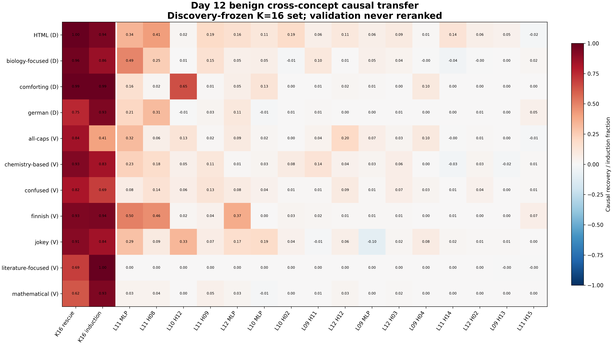
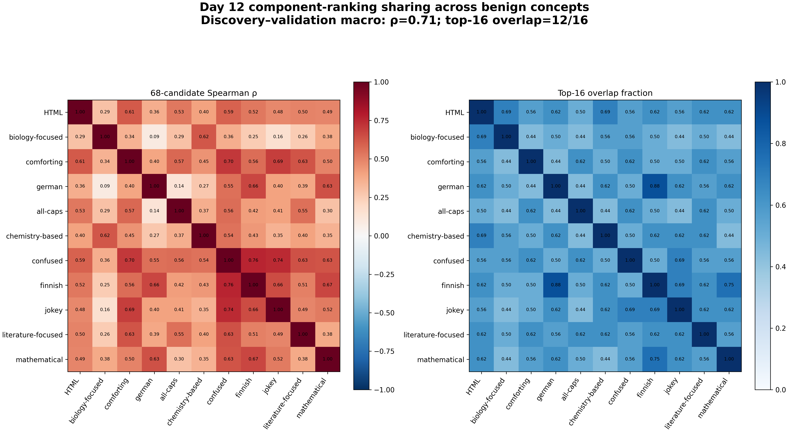

# Day 12 Benign Cross-Concept Transfer

Day 12 tested the discovery-frozen K=16 component set on seven held-out benign validation concepts without changing its identities, order, or size. It also measured all 68 eligible candidate effects per concept to distinguish identical sharing from concept-specific routing.

## Result

**Status: Pass — the Day 12 completion gate is satisfied.**

The unchanged K=16 set transfers directly to every validation concept. Validation macro rescue is **0.820 [0.810, 0.828]** and induction is **0.806 [0.800, 0.812]**. The selected-minus-random effects are **0.857 [0.846, 0.867]** for rescue and **0.761 [0.753, 0.769]** for induction. All 11 benign concepts independently have strictly positive rescue and induction intervals.

The frozen mechanistic classification is **concept-specific routing into a shared actuator**. This is not a claim that every concept uses disjoint components: the circuit shares a strong core, but its causal rankings and trigger-source roles are not identical.

## Direct transfer by concept

| Split | Concept | K16 rescue | K16 induction |
|---|---|---:|---:|
| Discovery | HTML | 0.999 | 0.943 |
| Discovery | Biology-focused | 0.965 | 0.865 |
| Discovery | Comforting | 0.990 | 0.991 |
| Discovery | German | 0.751 | 0.930 |
| Validation | All-caps | 0.837 | 0.405 |
| Validation | Chemistry-based | 0.926 | 0.832 |
| Validation | Confused | 0.819 | 0.694 |
| Validation | Finnish | 0.933 | 0.943 |
| Validation | Jokey | 0.913 | 0.840 |
| Validation | Literature-focused | 0.688 | 1.000 |
| Validation | Mathematical | 0.622 | 0.931 |

Each cell uses 64 positive examples and has a strictly positive paired 95% bootstrap interval. The table shows point estimates for readability.

## Ranking and overlap

Across all 68 candidates, discovery- and validation-macro rankings have **Spearman rho = 0.705**. Their descriptive top-16 lists overlap on **12/16** identities, giving an overlap coefficient of **0.75** and Jaccard similarity of **0.60**. This passes the frozen high-sharing rule.

Sharing is substantial but not identity-complete. Pairwise concept correlations range from 0.09 to 0.76, and pairwise top-16 overlap ranges from 7/16 to 14/16. The union of per-concept top-four selected attention heads contains 10 identities rather than four.

## Shared actuator and non-sparse routing

The selected four-MLP direct-output group passes the shared-actuator rule: discovery rescue/induction are 0.645/0.525 and validation rescue/induction are 0.370/0.433, with all four intervals strictly positive. Layer-11 MLP alone has positive point recovery on all 11 concepts and positive discovery and validation macro intervals.

The result does not support one shared sparse circuit. The selected K=4 prefix reaches **78.7%** of K=16 rescue on discovery and only **53.0%** on validation, below the frozen 80% rule. All 12 selected heads have more than one positive dominant trigger-source role across concepts under the frozen Day 11 source test. Because this specificity rule is permissive at eight examples per concept, it supports routing heterogeneity but not a unique semantic function for each head.

## Execution and verification

- 30,912 validation rows cover 448 frozen positives with one baseline and 68 candidate patches each.
- Combined with Day 8, the candidate matrix contains 48,576 rows across 11 benign concepts.
- The real checkpoint passed 68 exact identities and two vectorized equivalence checks.
- All raw rows name evaluator commit `ed19e41d669b9f347cd19c4207143f07f5aec1f0`.
- The complete analysis reproduced byte for byte on a second run.
- The independent audit passes all 20 checks.
- All 49 repository tests pass.
- Both 4,800 × 2,700 figures passed visual inspection.
- Safety remained locked and was never loaded.

## Frozen handoff to Day 13

The exact Day 8 K=16 set is now final in [frozen-final-component-set.json](frozen-final-component-set.json). The safety-only analysis implementation, hashes, central grid, metrics, bootstrap, and support rule are frozen in [frozen-confirmatory-analysis.json](frozen-confirmatory-analysis.json). The analysis refuses safety rows with modified selected or random membership.

## Artifacts

- [frozen-benign-transfer-plan.json](frozen-benign-transfer-plan.json): preregistered Day 12 design and interpretation rules.
- [validation-candidate-results.jsonl.gz](validation-candidate-results.jsonl.gz): deterministic complete validation archive.
- [benign-transfer-summary.json](benign-transfer-summary.json): complete causal, rank, overlap, actuator, source-role, and classification results.
- [benign-cross-concept-transfer-matrix.csv](benign-cross-concept-transfer-matrix.csv): 11 concepts × frozen K=16 effects plus direct set-level rescue/induction.
- [concept-ranking-agreement.csv](concept-ranking-agreement.csv): all 55 concept-pair correlations and overlaps.
- [candidate-macro-rankings.csv](candidate-macro-rankings.csv): discovery, validation, and all-benign 68-candidate rankings.
- [trigger-reader-source-roles.csv](trigger-reader-source-roles.csv): concept-level dominant source roles for all 12 selected heads.
- [validation-candidate-preflight.json](validation-candidate-preflight.json), [benign-transfer-audit.json](benign-transfer-audit.json), and [day12-artifacts.json](day12-artifacts.json): numerical preflight, independent audit, and artifact hashes.

The [full method](../../docs/day-12-benign-transfer-method.md), [procedure decision](../../decision-log/0015-freeze-day-12-benign-transfer-procedure.md), [final freeze decision](../../decision-log/0016-freeze-final-circuit-and-safety-analysis.md), and [lab note](../../lab-notes/day-12-test-benign-transfer.md) record the design, execution, and limits.
